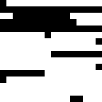
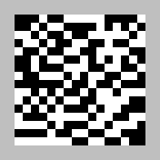
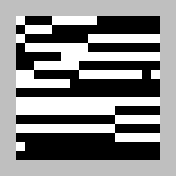
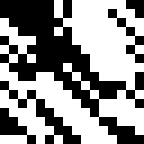
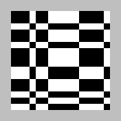
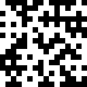
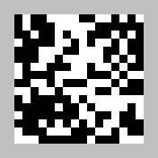

# File formats, data structures, and other key elements

## Detailed choice file

A `detailed choice file` is a .mat file that contains a set of similarity comparisons, typically collected in a psychophysical experiment.  Each line of the file corresponds to a single judgment.
It contains three variables: 'stim\_list', 'responses', and 'responses_colnames'.  'stim\_list' is a character array in which each row is a unique stimulus label.

File names should contain the string '\_detailed\_choices\_', preceded by a designation of the domain or paradigm, and followed by an identifier for the subject or data source.

* triadic comparisons

    * Column 1 of 'responses' is the 1-based trial number
    * Columns 2-4 of 'responses' are the 1-based indices into stim\_list of the reference stimulus and two comparison stimuli (s1 and s2).
    * Column 5 of 'responses' is 1 if s1 is judged more dis-similar to the reference than s2, and 0 otherwise
    * 'responses_colnames' are text strings that label these columns

See rs_py/samples/choice_files/\*\_detailed_choices\_S\*.mat for examples.

## Choice file

A `choice file` (also called a `combined choice file`) is a .mat file that contains a set of similarity comparisons, typically collected in a psychophysical experiment. In contrast to a `detailed choice file`, judgments from repeated presentations of the same stimuli are combined.  The file contains three variables: 'stim\_list', 'responses', and 'responses_colnames'.  'stim\_list' is a character array in which each row is a unique stimulus label.

File names should contain the string '\_choices\_', preceded by a designation of the domain or paradigm, and followed by an identifier for the subject or data source.

Two options are available for 'responses' and 'responses_colnames':

* triadic comparisons

    * Columns 1-3 of 'responses' are the 1-based indices into stim\_list of the reference stimulus and two comparison stimuli (s1 and s2).
    * Column 4 of 'responses' is the number of times that s1 is judged more dis-similar to the reference than s2
    * Column 5 of 'responses' is the number of times the triad is presented
    * 'responses_colnames' are text strings that label these columns

* tetradic comparisons

    * Columns 1-4 of 'responses' are the 1-based indices into stim\_list for the stimuli s1, s2, s3, and s4 in the comparison
    * Column 5 of 'responses' is the number of times that s1 and s2 are judged more dis-similar than s3 and s4
    * Column 6 of 'responses' is the number of times the tetrad is presented
    * 'responses_colnames' are text strings that label these columns

See samples/animals/image\_choices\_S\*.mat or samples/bwtextures/bgca3pt\_choices\_\*\_sess01\_10.mat for examples of triadic comparisons, and see samples/bwtextures/bgca3pt\_choices\_\*-gp\_sess01\_20.mat for examples of tetradic comparisons.

## Coordinate file

A `coordinate file` is a .mat file that contains sets of coordinates for the elements of a representational space. It contains a variable 'stim\_labels', a character array in which each row is a unique stimulus label. This corresponds to the `stim\_list` variable in a `choice file`, but the stimuli need not be listed in the same order. A `coordinate file` also contains one or more variables with names such as 'dim1', 'dim2', ..., 'dim10'. 'dim[k]' specifies the k-dimensional representational space:  each row corresponds to a stimulus in `stim\_labels`; the k columns are the k coordinate values.

File names should contain the string '\_coords\_', preceded by a designation of the domain or paradigm, and followed by an identifier for the subject or data source.

Optional variables (produced by the modeling of choice data by this package but not required) are:

* rawLLs: log(2) likelihood of the observed responses for each of k-dimensional models, uncorrected for overfitting
* bestModelLL: log(2) likelihood of the observed responses, given a model that exactly matches the observed choice probabilities but is geometrically unconstrained
* debiasedRelativeLL: relative log(2) likelihood, compared to bestModelLL, after correction for overfitting: debiasedRelativeLL = (rawLLs + biasEstimate) - bestModelLL
* biasEstimate: overfitting bias estimate
* metadata: summary of the above description

See samples/animals/image\_coords\_S\*.mat for examples that contain these optional variables, and samples/bwtextures/bgca3pt\_cooords\_\*\_sess01\_10.mat for examples that do not.

## Dataset structure

A `dataset structure` is a container for representational spaces to be analyzed in parallel -- for example, determining a consensus between them via `rs_knit_coordsets`, visualizing them via `rs_disp_coordsets`, or transforming them via `rs_xform_apply`. 

It consists of three components:  a `coordinate structure` ('ds'), a `stimulus metadata structure` ('sas'), and a `set metadata structure` ('sets'), each of which is a MATLAB cell array with the same number of records.  A single record contains the coordinates and metadata for a representational space models of one or more dimensions, all derived from a common dataset.

Typically a `dataset structure` is created by reading one or more `coordinate files` via `rs_get_coordsets`, a single `coordinate file` via `rs_read_coorddata`, or imported from coordinate arrays with user-supplied metadata via `rs_import_coordsets`.

### Coordinate structure

* For each record, 'ds{irec}', is a cell array in which 'd{irec}{k}' contains the coordinates for the k-dimensional model, as contained in the `coordinate file`. d{irec}{k} may be empty ('[]') if no model is available. 

### Stimulus metadata structure

* This contains the metadata that defines the stimulus set, and, optionally, data related to the analysis of 'choice files'.  For each record, 'sas{irec}' has the following fields:

    * nstims: number of stimuli
    * typenames: a 1-D cell array of stimulus labels.  Entries will match 'stim\_labels' in the `coordinate file` that was used to create the `dataset structure`.  This field is used to identify unique stimuli when merging datasets and records.
    * type\_coords: a 2-D array of `stimulus coordinates`, if the domain has a priori coordinates; typically empty if not. See `stimulus coordinates` for further details.
    * the optional variables \*LL\* and metadata from a `coordinate file`

### Set metadata structure

* This contains dataset origin.  For each record, 'sets{irec}' has the following fields:

    * dim\_list: list of available dimensions in ds{irec}
    * nstims: number of stimuli
    * label\_long: long file name, typically full file name and path
    * label: shortened file name, suitable for display
    * paradigm_name: a designator such as 'cars' or 'animals'
    * paradigm_type: overall paradigm category; may be the same as paradigm_name
    * subj\_ID: unique subject identifier
    * subj\_ID_short: short form of subject identifier, suitable for display
    * pipeline: structure describing the processing stages leading to this record

For an example of a `dataset structure` with one record and without `stimulus coordinates`, run the demo `rs_read_coorddata_demo_cars` and look at 'data_out'.
For an example of a `dataset structure` with three records and with `stimulus coordinates`, run the demo `rs_read_coorddata_demo_opposites` and look at 'data_out'.

## Stimulus coordinates

Some domains may be structured by an a priori set of coordinates for the stimuli -- for example, colors can be given coordinates according to their R, G, and B components.  Another example is the domain of adjectives, many of which come in opposite pairs. Specifying stimulus coordinates is optional, and for many domains -- for example, cars, or musical instruments -- it may not be appropriate. To use stimulus coordinates, specify them as a numerical array in the 'stimulus metadata structure`.  The rows of the array correspond to the stimuli  (in the order of 'sas{irec}.typenames'), and each column is a dimension.

*  For generic domains, stimulus coordinates are in the `type_coords` field of the `stimulus metadata structure`.  They can be set directly or specified at the time of reading or importing via auxiliary inputs in  `rs_get_coordsets`, `rs_read_coorddata`, or `rs_import_coordsets`.
*  For `binary texture` domains, these values are specified in the `setup metadata` and are in the `btc_specoords` and `btc_augcoords` fields of the `stimulus metadata structure`, with priority given to `btc_augcoords` if both are specified.
*  In either case, stimulus coordinates are applied to each record of the 'dataset structure', so they need to need to be listed in each record of the `stimulus metadata structure`, i.e., in 'sas{irec}.type_coords', or 'sas{irec}.btc_augcoords'.

`Stimulus coordinates` may be used to:

* To create a `ray structure`, to enhance visualization of representational spaces via `rs_disp_enh_coordsets` (demo: run `rs_read_coorddata_demo_opposites`, then `rs_disp_coordsets_demo_opposites`)
* To create `quadratic form models` for representational spaces via `rs_read_coordsets` (demo: run `rs_read_coorddata_demo_opposites`, option 3)

### Ray structure

When the stimulus domain is structured, a `ray structure` identifies simple relationships among the `stimulus coordinates`:

* stimuli that lie on rays (points on approximate straight lines from the origin)
* stimuli that lie on rings (coplanar points at approximately equal distances from the origin)
* nearest neighbors

The `ray structure` is created by `rs_findrays`, and its auxiliary inputs may be used to set the minimum number of points needed to form a ray, the tolerances for collinearity, etc. 

## Transformation structures

`Transformation structures` specify geometric transformations, including linear transformations and several generalizations.

Transformations can be applied to `dataset structures` by `rs_xform_apply`.

Transformations can be specified directly by the fields below, or can be constructed in several ways:

* `rs_xform_specify`: Creates transformations that translate and rotate a dataset, using model class 'affine'.
* `rs_knit_coordsets`: Creates transformations that align one dataset with another, using model class 'affine'.
* `rs_geofit`: Finds transformations that fit the relationship between one dataset and another, using transformations of the model classes 'mean', `procrustes`, `affine`, `projective`, and `pwaffine` (fitting of `pwprojective` (piecewise projective) transformations are not currently supported).

The diagram below shows the available geometric transformations. Note that some transformations are special cases of others, i.e., nested within a more general transformation.  These relationships are indicated by the green arrows in the diagram. The more general transformation will always provide a fit that is at least as good as one that is nested in it, but at a cost of having more parameters.  `rs_geofit` provides statistics for model comparison and selection between such pairs of nested models.  See demos??

<figcaption>Geometric transformations and their grouping into model classes (pale green and right column). Green arrows indicate nesting relationships:  the transformation at the beginning of the arrow is a more general version of the transformation at the end. </figcaption>

For transformations on a representational space of dimension k, a `transformation structure` has the following fields:

* b: a scalar multiplier
* T: a square array of size [k k] or (for 'pwaffine' and 'pwprojective', a stack of such arrays, see below)
* c: a vector of size [1 k] or (for 'pwaffine' and 'pwprojective', a stack of such vectors, see below)
* additional arguments, depending on 'class'

    * For class='projective' (a projective transformation): p is a vector of size [k 1]
    * For class='pwaffine' (a piecewise affine transformation with ncuts cuts): c is [ncuts k], T is a 3D array of size [k k 2ncuts], acut is [ncuts 1], and vcut is [ncuts k]
    * For class='pwprojective' (a piecewise projective transformation with ncuts cuts): the parameters in 'projective' and 'pwaffine', with p an array of size [k 2ncuts]
  
To allow for compatibility with transformations produced by `procrustes` (a MATLAB built-in), or `procrustes_consensus`, the following alternative names are allowed: b -> scaling, T -> orthog, c -> translation

The transformation applied to a row vector x produces a row vector y as follows:

* 'affine','procrustes','mean': These are linear transformations with an optional offset component, y=b\*xT+c. (Note, for 'procrustes', abs(det(T)) should equal 1, and for 'mean', T should equal 0.)
* 'projective':  This is a projective (or perspective) transformation. An array Taug of size [k+1 k+1] is formed with b\*T in its upper left, p in its upper right, c in its lower left, and 1 in its lower right. xaug is created by adjoining a 1 to the right of x. Then yaug=xaug\*Taug is computed, and y is the first k elements of yaug divided by its last.  For p=0, this reduces to an affine transformation.
* 'pwaffine': This is a piecewise affine transformation.  There are ncuts hyperplanes, each defined by their normal vectors given in vcut.  To determine the component of the space that x lies in, s=sign(x\*vcutT-acut) is computed. The affine transformation used ('ipw') is determined by the entries in s: s=[+1 +1 ... +1] corresponds to ipw=1, [-1 +1 ... +1] corresponds to ipw=2, [+1 -1 ... +1] corresponds to ipw=3,..., and [-1 -1 ... -1] corresponds to ipw=2ncuts. Then T(:,:,ipw) and c(ipw,:) are used to compute the transformation, as in 'affine' above.  Notes:

    * The same value of b is used for all components. 
    * For transformations created by `rs_geofit`, the pieces of the transformation are continuous where they meet at their boundaries.

* 'pwprojective':  The component is determined as in 'pwaffine', and the transformation is carried out as in 'projective', with p(:,ipw)

Note that the same transformation can be expressed in many ways -- for example, the scale factor b can be absorbed into T, and the cutplanes of a piecewise transformation can be permuted.

##Domains

### Binary texture domain

The binary texture domain is a space of synthetic visual textures, introduced in  [Victor and Conte (2012) Local image statistics: maximum-entropy constructions and perceptual salience. Journal of the Optical Society of America A, 29, 1313-1345](http://www.opticsinfobase.org/josaa/viewmedia.cfm?uri=josaa-29-7-1313&seq=0). References illustrating their use in psychophysical, neurophysiological, and computational studies are [here](http://www-users.med.cornell.edu/~jdvicto/jdvpubsi.html).

Textures consist of black and white checks, whose arrangements are specified by ten local image statistics.  The statistics are grouped by order:

* $\gamma$, the first-order statistic, which specifies the overall fraction of white vs. black checks
* $\beta$, four second-order statistics, which specify the probability that a check matches its neighbor horizontally or vertically, or along the diagonals
* $\theta$, four third-order statistics, which specify the probability that there is an even vs. odd number of white checks in triangular clusters
* $alpha$, the fourth-order statistic, which specifies the probability that there is an even vs. odd number of white checks in 2x2 square clusters

Together, these ten statistics determine the probability of all 2x2 blocks of checks, and the textures they generate are maximum-entropy subject to those constraints. Each of these statistics range from -1 to 1, and when all ten are zero, the resulting texture is random.  

<figcaption>The ten binary texture coordinates and their code letters. Adapted from Victor, J.D., Thengone, D.J., Rizvi, S.M., and Conte, M.M. (2015) A perceptual space of local image statistics.  Vision Research 117, 117-135.</figcaption>

Stimuli are named according to the values of the specified coordinates, using the above single-letter codes, followed by 'p' for positive or 'm' for negative, followed by four digits indicating the coordinate magnitude. 'rand' indicates the random texture.  Examples, along with samples of the corresponding textures, are shown below.  

<figcaption>A sample of texture bp0900, i.e., $\beta$-=+0.9</figcaption>

<figcaption>A sample of texture cm0450, i.e., $\beta$|=-0.45</figcaption>

<figcaption>A sample of texture bp0900cm0450, i.e., $\beta$-=+0.9</figcaption> and  $\beta$|=-0.45</figcaption>

<figcaption>A sample of texture dp0600, i.e., $\beta$\=+0.6</figcaption>

<figcaption>A sample of texture ap1000, i.e., $\alpha$=+1.0</figcaption>

<figcaption>A sample of texture am0667, i.e., $\alpha$=-0.667</figcaption>

<figcaption>A sample of texture rand, i.e., the random binary texture</figcaption>

Stimulus coordinates are 10-element vectors, in the `btc_specoords` and `btc_augcoords` fields of the `stimulus metadata structure`.  In the  `btc_specoords` field, the un-specified coordinates are indicated as 'NaN'.  In the  `btc_augcoords` field, these NaN values are replaced by the coordinate values determined by maximum entropy. Algorithms for generating these textures and further details may be found in  [Victor and Conte (2012)](http://www.opticsinfobase.org/josaa/viewmedia.cfm?uri=josaa-29-7-1313&seq=0).

Demos: ??
 
### Animal domain

The animal domain is a set of 37 common animals, introduced in [Waraich, S.A., and Victor, J.D. (2022) A psychophysics paradigm for the collection and analysis of similarity judgments. J. Vis. Exp. (181), e63461, doi:10.3791/63461 (2022)](https://dx.doi.org/10.3791/63461) and used in [Waraich, S.A., and Victor, J.D. (2024) The geometry of low- and high-level perceptual spaces. J. Neurosci. 44(4):e1460232023](https://www.jneurosci.org/content/44/4/e1460232023).

Each of these animals can be rendered in any of five ways, to create five paradigms, varying in the extent to which the original animal is recognizable.  Paradigm names are  'texture','intermediate_texture','intermediate_object','image','word' (the 'texture' rendering is fully texturized and unrecognizable; the 'image' paradigm is the original image, in 'word', the image is replaced by the name of the animal).  Examples are shown below.

<figcaption>Stimuli from the five paradigms of the animal domain. From Waraich and Victor (2024), The geometry of low- and high-level perceptual spaces. J. Neurosci. 44(4):e1460232023.</figcaption>

###Other example domains

#### MPI faces domain

This domain corresponds to the stimuli in Ebner, N. C., Riediger, M., & Lindenberger, U. (2010). FACES—A database of facial expressions in young, middle-aged, and older women and men: Development and validation. Behavior Research Methods, 42, 351-362. doi:10.3758/BRM.42.1.351.

#### Color Textures

#### Cars

This is a generic unstructured domain.

Demos: `rs_read_coorddata_demo_cars` to read a `dataset structure`; `rs_disp_coordsets_demo_cars` to display the representational space

#### Opposites

This is a generic structured domain with `stimulus coordinates`.

Demos: `rs_read_coorddata_demo_opposites` to read a `dataset structure` and also illustrate a `quadratic form model`; `rs_disp_coordsets_demo_opposites` to display the representational space

## Setup metadata

for Binary texture domain
or if configured

## Quadratic form model

