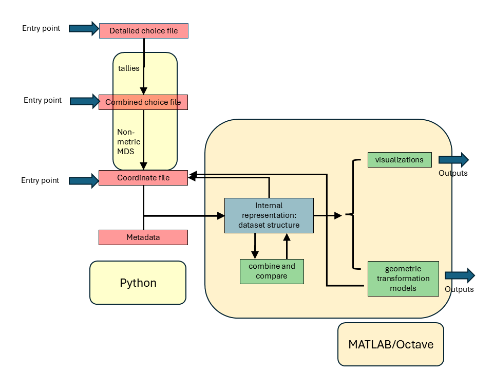

# Welcome to Representational Spaces software (rs-software)

## 

## Introduction

This software package is a set of tools to construct and analyze representational spaces.

A "representational space" is a construct in which elements in a domain are points, and the distances between the points correspond to dis-similarity. Often, representational spaces are constructed for perceptual domains: for example, colors, animals, musical instruments, etc., and are then referred to as "perceptual spaces." Representational spaces may also be constructed from neural data, e.g., fMRI or multineuronal recordings.

The package has two main components that may be used together or independently. One component enables creation of representational spaces from similarity data; its output consists of coordinate sets, metadata, and statistics. A second component of the software consists of tools to analyze, manipulate, and compare representational spaces.  While it is designed to operate on the outputs of the first component, it functions independently, and can readily import coordinate data and metadata from another source. Each of the two components of the package has its own set of installation instructions, demos and samples. As the appropriate number of dimensions for a representational space is typically unknown, the software is designed to process representations across a range of dimensions in parallel.

For creation of representational spaces, implementations are provided in Python ??, via a Matlab wrapper over Python code ??, and web-based via Streamlit (no installation needed).

For manipulation and visualization of representational spaces, implementations are available in Matlab ?? or via a Python wrapper over Matlab code ??.

In addition, routines are available for analysis of the perceptual judgments directly.  These include a comparison of the perceptual judgments via the representational spaces they generate (??link to comparison page) and analyses of statistics of triadic judgments (Matlab ?? or via a Python wrapper ??)

<figcaption>Overview of workflow.</figcaption>

## Tools for creating representational spaces from perceptual judgments

The starting point is a set of perceptual judgments and the associated metadata, typically contained in a `choice file`.  Three kinds of paradigms are supported:

* "triadic" judgments:  is A or B more similar to S?
* "tetradic" judgments: which is more similar: A and B, or C and D?
* "odd one out" judgments:  of A, B, and C, which is the most different?  To use judgments for these paradigms, first convert odd-one-out choice files to triadic judgment choice files via the conversion tool here??.

The main outputs are `coordinate files`, which contain coordinates of the points in a representational space and the associated metadata, and with statistics to assess how well these coordinates account for the similarity judgments.

Key demos are ??

This component is written in Python.  It may be run from a MATLAB/Octave environment as shown here ??

## Tools for manipulating representational spaces

The starting point is a representational space, read from a `coordinate file`, or, from another source. For example, representational spaces may also be

  * inferred from perceptual judgments via other procedures, such as multidimensional scaling
  * obtained in another way -- for example, from neural data via a dimension-reduction technique such as principal components analysis

The key operations performed are

* Combining representational spaces across paradigms, stimulus sets, subjects, etc.  (`rs_knit_coordsets`)

    * finding a consensus space across several sources
    * knitting together spaces with partially overlapping elements

* Visualizations (`rs_disp_coordsets`)
* Modeling transformations between representational spaces: affine, projective, piecewise affine (`rs_geofit`)
* Statistics related to these operations

The main outputs are coordinate sets and the associated metadata, geometric models of transformations, graphics, and statistics. 

Key demos are ??

This component is written in MATLAB and is Octave-compatible.  MATLAB routines are in `rs`; many of these are primarily wrappers around routines in `psg` that carry out the numerics.  MATLAB code may be accessed from a Python environment as shown here ??

## Tools for analyzing perceptual judgments

With a starting point of a single `choice file` of triadic judgments, one may

  * determine the Dirichlet distribution parameters of the choice distribution, via `rs_dirfit_choicedata`
  * determine compatibility of the triadic judgments with symmetry and the ultrametric inequality, via `rs_symumi_choicedata`

With a starting point of a two `choice files` of triadic judgments, one may

  * determine whether the representational spaces they generate are significantly different via ??

## Credits and feedback

Jonathan Victor [jdvicto@med.cornell.edu](mailto:jdvicto@med.cornell.edu) (please direct feedback)

Suniyya Waraich [swaraich@ucdavis.edu](mailto:swaraich@ucdavis.edu)

Guillermo Aguilar [guillermo.aguilar@mail.tu-berlin.de](mailto:guillermo.aguilar@mail.tu-berlin.de)

Ehlaam Hanwari [ehh4004@med.cornell.edu](mailto:ehh4004@med.cornell.edu)

