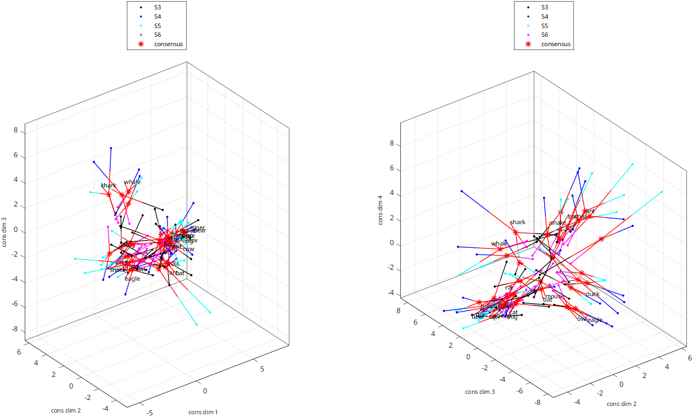

# rs_align_disp_coordsets_demo
Demonstration workflow for display of several datasets and their consensus

Workflow:

 - data files are read
 - data files are aligned (coordinates each stimulus are placed in corresponding rows)
 - a consensus is calculated by rotating each dataset so that the coordinates are as closely matched as possible
 - the component datasets
 - the original data, the components, and the consensus are displayed

Plot options illustrated:

 - choice of dimension and coordinates to plot
 - several plots into same figure
 - selective datapoint labelling with custom callouts
 - custom arrangement of subplots
 - rotation of raw data coordinates into a consensus
 - combining consensus and individual datasets on same plot
 - custom data point symbols
 - custom axis labels
 - custom labeling of datasets based on subject ID
 - connecting corresponding points between plots
 - selection of data points to label based on length of stimulus name

See also:  [rs_get_coordsets](rs_get_coordsets.md), [rs_align_coordsets](rs_align_coordsets.md), [rs_knit_coordsets](rs_knit_coordsets.md), [rs_concat_coordsets](rs_concat_coordsets.md), [rs_disp_coordsets](rs_disp_coordsets.md)

%section to force btc defaults, even if rs_aux_defaults.mat has been created or modified

```matlab
if ~exist('aux_force_filename') aux_force_filename='rs_aux_defaults_btc.mat'; end
auxs_force=struct;
opts_needed={'opts_read','opts_rays','opts_check','opts_align','opts_qpred','opts_knit','opts_disp'};
for k=1:length(opts_needed)
    auxs_force.(opts_needed{k})=rs_aux_force(opts_needed{k},[],aux_force_filename);
end
```

## Read four datasets
Datasets are from four subjects of Waraich and Victor, J. Neurosci. 2024

```matlab
filenames={'./samples/animals/image_coords_S3','./samples/animals/image_coords_S4','./samples/animals/image_coords_S5','./samples/animals/image_coords_S6'};
nsets=length(filenames);
aux_in=auxs_force;
aux_in.opts_read=setfields(aux_in.opts_read,{'input_type','if_auto','if_log'},{1,1,1}); %input type 1=data, if_auto=1: non-interactive, if_log=1 to log
aux_in.nsets=nsets;
```

Read the coordinates of each dataset with `rs_get_coordsets`

```matlab
[data_read,aux_read]=rs_get_coordsets(filenames,aux_in);
subj_ids=cell(1,nsets);
for iset=1:nsets %extract the subject ids for plot labels
    subj_ids{iset}=data_read.sets{iset}.subj_id;
end
nstims=data_read.sas{1}.nstims; %number of stimuli; assume same in all sets
label_maxlength=5; %max length of a stimulus label
data_label_list=[];
for istim=1:nstims %create a list of short stimulus labels
    if length(data_read.sas{1}.typenames{istim})<=label_maxlength
        data_label_list(end+1)=istim;
    end
end
```

Output:

```text
 
 entering set  1 of  4:
primary dataset 1 is experimental data
 37 different stimulus types found in  data file ./samples/animals/image_coords_S3
 37 different stimulus types found in setup file [unused]
 37 of  37 labels found
coordinate sets with  1 to  7 dimensions read.
 
 entering set  2 of  4:
primary dataset 2 is experimental data
 37 different stimulus types found in  data file ./samples/animals/image_coords_S4
 37 different stimulus types found in setup file [unused]
 37 of  37 labels found
coordinate sets with  1 to  7 dimensions read.
 
 entering set  3 of  4:
primary dataset 3 is experimental data
 37 different stimulus types found in  data file ./samples/animals/image_coords_S5
 37 different stimulus types found in setup file [unused]
 37 of  37 labels found
coordinate sets with  1 to  7 dimensions read.
 
 entering set  4 of  4:
primary dataset 4 is experimental data
 37 different stimulus types found in  data file ./samples/animals/image_coords_S6
 37 different stimulus types found in setup file [unused]
 37 of  37 labels found
coordinate sets with  1 to  7 dimensions read.
 
datasets selected:
 set  1: dim range [  1   7] label: samples/animals/image_S3
 set  2: dim range [  1   7] label: samples/animals/image_S4
 set  3: dim range [  1   7] label: samples/animals/image_S5
 set  4: dim range [  1   7] label: samples/animals/image_S6
##### rs_warning: cannot find stimulus coordinates, so cannot identify rays
##### rs_warning: cannot find stimulus coordinates, so cannot identify rays
##### rs_warning: cannot find stimulus coordinates, so cannot identify rays
##### rs_warning: cannot find stimulus coordinates, so cannot identify rays
```

## Display the original data

```matlab
coord_groups=[1 2 3;2 3 4]; %make two 3-d plots, one with dimensions 1,2,3, one with dimensions 2,3,4
ngroups=size(coord_groups,1);%
hfig=figure; %open a figure for the plots
opts_disp_raw=auxs_force.opts_disp;
opts_disp_raw.fig_handle=hfig;
opts_disp_raw.fig_position=[100 100 1200 800];
opts_disp_raw.fig_name='raw data';
opts_disp_raw.dim_select=4; %display coordinates for the 4-dimensional model
opts_disp_raw.coord_group_size=size(coord_groups,2); %display coordinates in groups of 3
opts_disp_raw.coord_group_method='list'; %we explictly list the coordinate groups
opts_disp_raw.coord_groups=coord_groups;
opts_disp_raw.set_labels=subj_ids; %label each plot with subject ID
opts_disp_raw.data_label_method='list'; %we provide a list for the labels for each data point
opts_disp_raw.data_label_list=data_label_list; %labels for each data point
opts_disp_raw.callout_amount=0.3; %labels are slightly removed from each data point
opts_disp_raw.callout_colors='set_colors'; %use the color assigned to each dataset for the callout lines
opts_disp_raw.callout_linestyles='-'; %dashed callout lines
opts_disp_raw.legend_location='North'; %legend location
```


```matlab
aux_out_raw=cell(1,ngroups);
haxes=cell(1,ngroups);
for iset=1:nsets
```

<div class="demo-indent" style="margin-left: 4ch" markdown="1">

each call to rs_disp_coordsets will plot data from one subject, both coordinate groups

</div>

```matlab
    for igroup=1:2 %set up subplots for this subject
        haxes{igroup}=subplot(ngroups,nsets,iset+(igroup-1)*nsets); %first row is first coord group, second row is second coord group
    end
    opts_disp_raw.axis_handles=haxes;
    opts_disp_raw.set_select=iset; %subject selection
    aux_out_raw{iset}=rs_disp_coordsets(data_read,setfield(struct,'opts_disp',opts_disp_raw)); %create the plot
end
```

align data, rotate data into a consensus, and use each component, aligned to consensus, for further plotting

```matlab
aux_align_def=auxs_force.opts_align;
[data_align,aux_align]=rs_align_coordsets(data_read,aux_align_def);
aux_knit_def=auxs_force.opts_knit;
[data_consensus,aux_knit]=rs_knit_coordsets(data_align,aux_knit_def);
data_label_list_consensus=[]; %stimulus order may have changed, so need to re-identify the stimuli
for istim=1:nstims
    if length(data_consensus.sas{1}.typenames{istim})<=label_maxlength
        data_label_list_consensus(end+1)=istim;
    end
end
```

Output:

```text
proceeding with alignment of   4 datasets, paradigm type animals, stimuli must be present in 1
alignments attempted with  4 datasets
 set   1: stimuli:  37, type       data, label samples/animals/image_S3
 set   2: stimuli:  37, type       data, label samples/animals/image_S4
 set   3: stimuli:  37, type       data, label samples/animals/image_S5
 set   4: stimuli:  37, type       data, label samples/animals/image_S6
 unique typenames:  37
 typenames present in at least  1 datasets:  37
if_type_coords_remake=1 (determined from metadata)
##### rs_warning: cannot find stimulus coordinates, so cannot identify rays
##### rs_warning: cannot find stimulus coordinates, so cannot identify rays
##### rs_warning: cannot find stimulus coordinates, so cannot identify rays
##### rs_warning: cannot find stimulus coordinates, so cannot identify rays
 number of stimuli missing in dataset   1:    0
 number of stimuli missing in dataset   2:    0
 number of stimuli missing in dataset   3:    0
 number of stimuli missing in dataset   4:    0
data table
    37    37    37    37
    37    37    37    37
    37    37    37    37
    37    37    37    37

sa_pooled and data_align will be created.
NaN removal attempted with  4 datasets
 set   1: stimuli:  37, type       data, label samples/animals/image_S3
 set   2: stimuli:  37, type       data, label samples/animals/image_S4
 set   3: stimuli:  37, type       data, label samples/animals/image_S5
 set   4: stimuli:  37, type       data, label samples/animals/image_S6
 unique typenames:  37
proceeding with alignment of   4 datasets, paradigm type animals, stimuli must be present in 1
alignments attempted with  4 datasets
 set   1: stimuli:  37, type       data, label samples/animals/image_S3
 set   2: stimuli:  37, type       data, label samples/animals/image_S4
 set   3: stimuli:  37, type       data, label samples/animals/image_S5
 set   4: stimuli:  37, type       data, label samples/animals/image_S6
 unique typenames:  37
 typenames present in at least  1 datasets:  37
if_type_coords_remake=1 (determined from metadata)
##### rs_warning: cannot find stimulus coordinates, so cannot identify rays
##### rs_warning: cannot find stimulus coordinates, so cannot identify rays
##### rs_warning: cannot find stimulus coordinates, so cannot identify rays
##### rs_warning: cannot find stimulus coordinates, so cannot identify rays
knitting  37 stimuli across   4 datasets, dimensions   1  2  3  4  5  6  7
  allow reflection: 1, allow offset: 1, allow scale: 0, normalize scale: 0, rotate to pcs: 0
 calculations with allow_scale=0, if_normscale=0
 set  1: created shuffles for  37 stimuli
 set  2: created shuffles for  37 stimuli
 set  3: created shuffles for  37 stimuli
 set  4: created shuffles for  37 stimuli
 creating Procrustes consensus from dim  1 to dim  1 based on component datasets, iterations:    2, final total rms dev per coordinate:  2.50094
 creating Procrustes consensus from dim  2 to dim  2 based on component datasets, iterations:    8, final total rms dev per coordinate:  2.82280
 creating Procrustes consensus from dim  3 to dim  3 based on component datasets, iterations:   17, final total rms dev per coordinate:  2.93191
 creating Procrustes consensus from dim  4 to dim  4 based on component datasets, iterations:   11, final total rms dev per coordinate:  2.86859
 creating Procrustes consensus from dim  5 to dim  5 based on component datasets, iterations:   16, final total rms dev per coordinate:  2.88087
 creating Procrustes consensus from dim  6 to dim  6 based on component datasets, iterations:   23, final total rms dev per coordinate:  2.91432
 creating Procrustes consensus from dim  7 to dim  7 based on component datasets, iterations:   52, final total rms dev per coordinate:  2.92061
##### rs_warning: cannot find stimulus coordinates, so cannot identify rays
```

```matlab
opts_disp_cons=opts_disp_raw; %many options match the raw plot
opts_disp_cons=rmfield(opts_disp_cons,'fig_handle'); %new figure
opts_disp_raw.fig_position=[80 100 1400 800];
opts_disp_cons=rmfield(opts_disp_cons,'axis_handles');
opts_disp_cons.fig_name='consensus';
opts_disp_cons.set_select=[1:nsets+1];
opts_disp_cons.axis_label_prefix='cons dim';
opts_disp_cons.data_label_list=data_label_list_consensus;
```

concatenate the component data and the consensus

```matlab
data_cons=rs_concat_coordsets(aux_knit.components,data_consensus);
```

```matlab
opts_disp_cons.set_labels{nsets+1}='consensus';
opts_disp_cons.connect_sets_method='star_last';
for k=1:nsets
    opts_disp_cons.set_markers{k}='.';
end
opts_disp_cons.set_markers{nsets+1}='*';
opts_disp_cons.data_label_setsel_method='last';
opts_disp_raw.callout_amount=1.0;
```

```matlab
rs_disp_coordsets(data_cons,setfield(struct,'opts_disp',opts_disp_cons));
```

