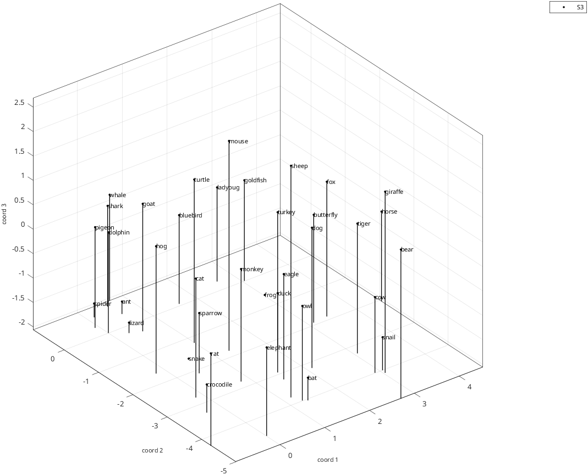
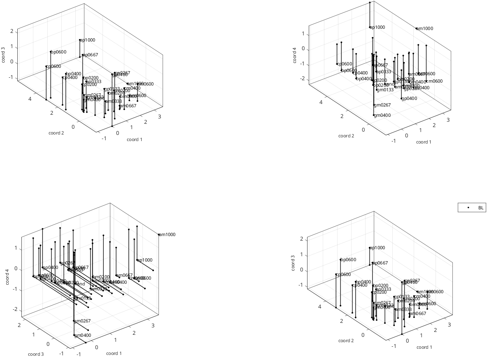
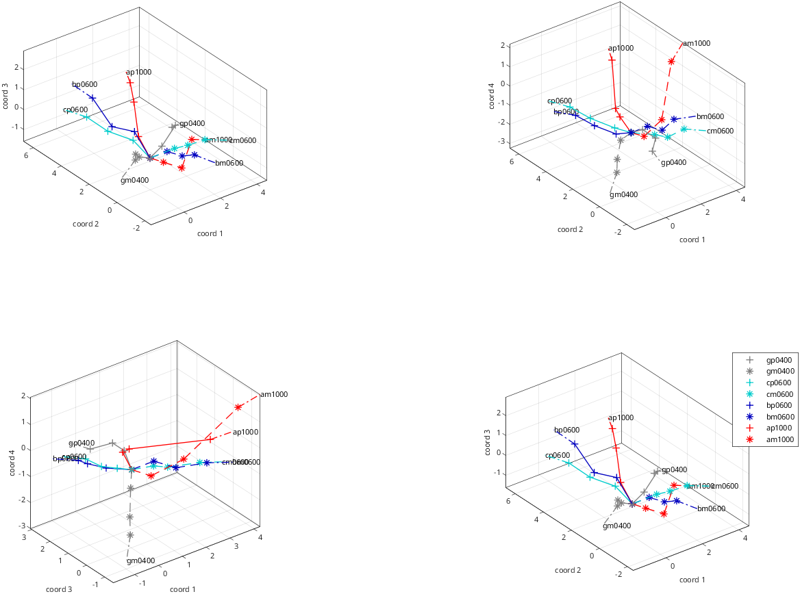
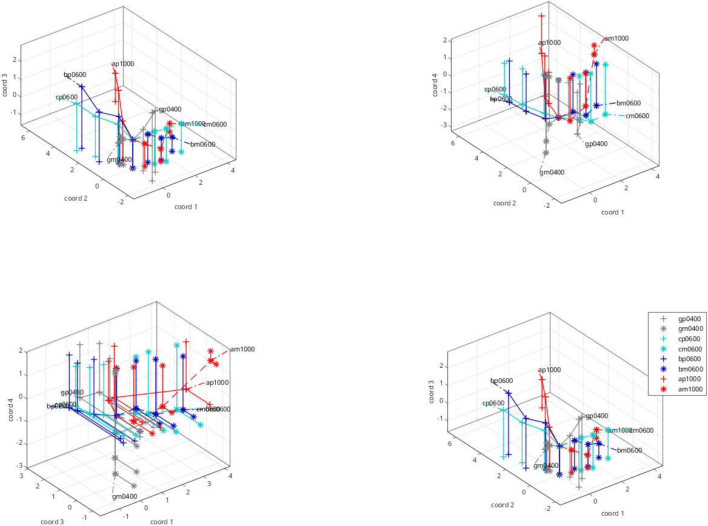
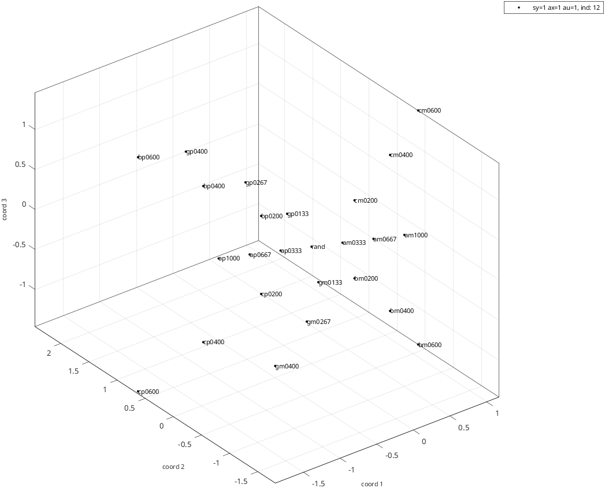
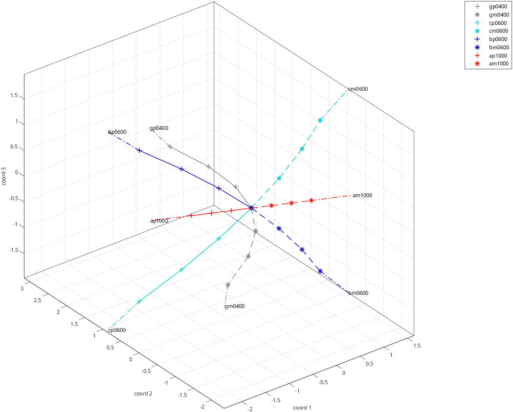
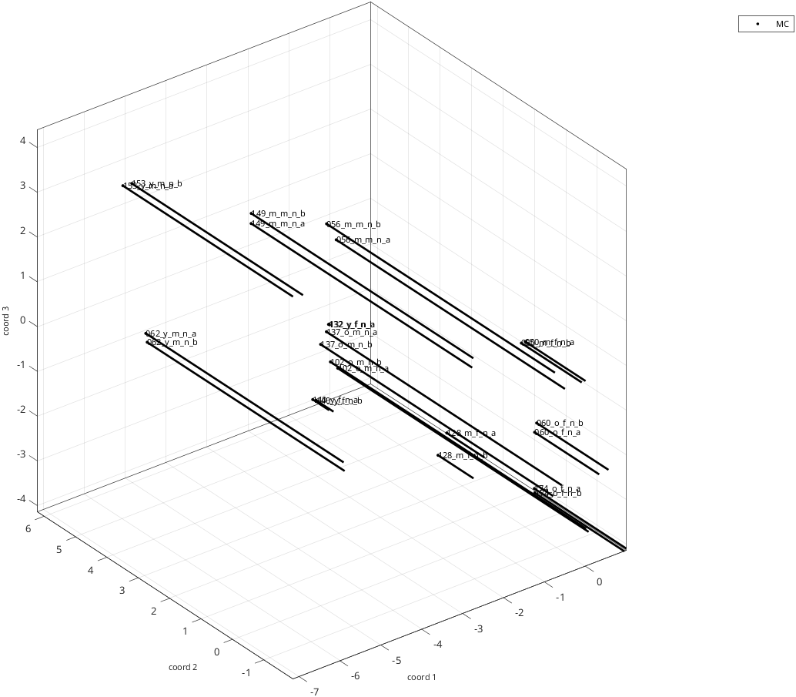
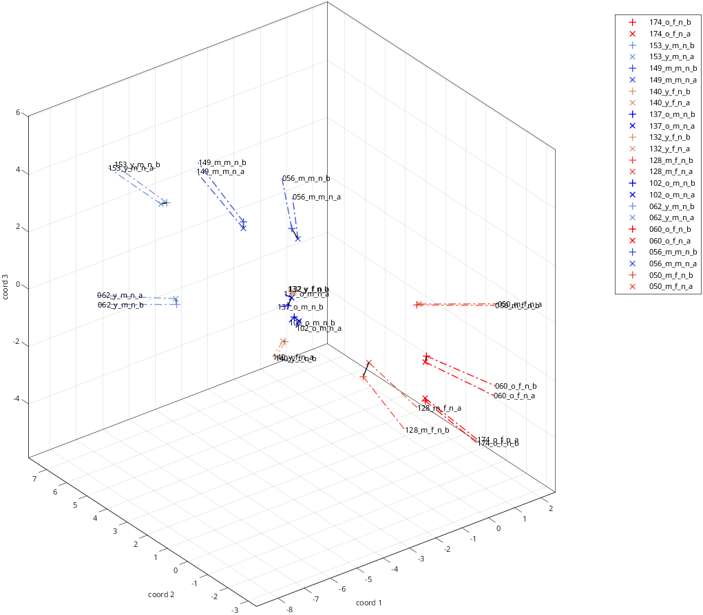
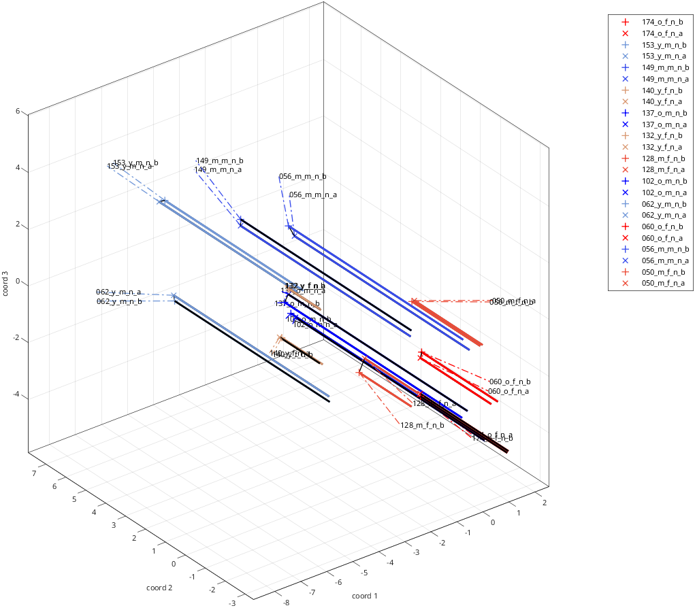

# rs_disp_coordsets_demo
Simple display of coordinate sets

Workflow:

 - data files are read
  -data are displayed

Plot options illustrated:

 - custom labeling of datasets based on subject ID
 - custom interpreter for stimuus labels and legend
 - plotting dropped perpendiculars
 - basic plots of rays

See also:  [rs_get_coordsets](rs_get_coordsets.md), [rs_disp_coordsets](rs_disp_coordsets.md), [rs_disp_enh_coordsets](rs_disp_enh_coordsets.md)

section to force btc defaults, even if rs_aux_defaults.mat has been created or modified

```matlab
if ~exist('aux_force_filename') aux_force_filename='rs_aux_defaults_btc.mat'; end
auxs_force=struct;
opts_needed={'opts_read','opts_rays','opts_qpred','opts_disp'};
for k=1:length(opts_needed)
    auxs_force.(opts_needed{k})=rs_aux_force(opts_needed{k},[],aux_force_filename);
end
filenames={...
    './samples/animals/image_coords_S3',... %example 1: animal experiment image domain, Warich and Victor, J. Neurosci. 2024
    './samples/bwtextures/bgca3pt_coords_BL_sess01_10',...; %example 2: binary texture experiment, Victor and Conte, VSS 2025
    './samples/bwtextures/bgca3pt_coords_BL_sess01_10',...; %example 3: binary texture experiment, Victor and Conte, VSS 2025, quadratic form model
    './samples/faces/faces_mpi_en2_fc_coords_MC_sess01_10'}; %example 4: MPI faces dataset, Ebner, N. C., Riediger, M., & Lindenberger, U. (2010). FACES—A database of facial expressions in young, middle-aged, and older women and men: Development and validation. Behavior Research Methods, 42, 351-362. doi:10.3758/BRM.42.1.351
nex=length(filenames);
```

```matlab
aux_in=cell(1,nex);
data_read=cell(1,nex);
aux_read=cell(1,nex);
```

```matlab
opts_disp=cell(1,nex);
aux_out=cell(1,nex);
opts_disp_enh=cell(1,nex);
aux_out_enh=cell(1,nex);
for iex=1:nex
    disp('************** ');
    disp(sprintf(' example %2.0f',iex));
    aux_in{iex}=auxs_force;
    aux_in{iex}.opts_read=setfields(aux_in{iex}.opts_read,{'input_type','if_auto','if_log'},{1,1,1}); %input type 1=data, if_auto=1: non-interactive, if_log=1 to log
    aux_in{iex}.nsets=1;
    if_enh=0;
    paradigm_type_assert=[];
    typename_prefix=[];
    opts_disp{iex}=struct;
    opts_disp_enh{iex}=struct;
    switch iex %handle exceptions
        case 1 %animals
            opts_disp{iex}.perp_data_dims=[0 0 1]; %show perpendicular 
            opts_disp{iex}.perp_data_usemarkers=0; %no markers
        case 2 % binary textures, data
            opts_disp{iex}.dim_select=4;
            opts_disp{iex}.if_legend=-1;
            opts_disp{iex}.coord_group_method='keepone';
            opts_disp{iex}.perp_data_dims=[0 0 1 -1]; %show perpendiculars
            if_enh=1; %also do enhanced plot
            opts_disp_enh{iex}.if_points=0;
        case 3 % binary textures, quadratic model,
            aux_in{iex}.opts_read.input_type=2; %model
            if_enh=1; %also do enhanced plot
            paradigm_type_assert='btc';
            opts_disp_enh{iex}.if_points=0;
        case 4 %faces
            if_enh=1;
            aux_in{iex}.opts_rays.ray_minpts=1; %single points can define a ray
            opts_disp{iex}.perp_data_dims=[0 1 0]; %show perpendiculars
            opts_disp{iex}.perp_data_usemarkers=0; %no markers
            opts_disp{iex}.perp_data_linewidths=2;
            opts_disp{iex}.data_label_interpreter='none';
            opts_disp{iex}.legend_interpreter='none';
            opts_disp_enh{iex}.if_points=0;
    end
```

<div class="demo-indent" style="margin-left: 4ch" markdown="1">

read the coordinates and metadata

</div>

```matlab
    [data_read{iex},aux_read{iex}]=rs_get_coordsets(filenames{iex},aux_in{iex});
    if ~isempty(paradigm_type_assert) %optionally assert paradigm type
        data_read{iex}.sets{1}.paradigm_type=paradigm_type_assert;
    end
    if ~isempty(typename_prefix) %optionally shorten typenames
        data_read{iex}.sas{1}.typenames=strrep(data_read{iex}.sas{1}.typenames,typename_prefix,'');
    end
    disp(data_read{iex}.sets{1});
    subj_id=data_read{iex}.sets{1}.subj_id;
    opts_disp{iex}.set_labels=data_read{iex}.sets{1}.subj_id;
```

<div class="demo-indent" style="margin-left: 4ch" markdown="1">

plot

</div>

```matlab
    aux_out{iex}=rs_disp_coordsets(data_read{iex},setfield(struct,'opts_disp',opts_disp{iex})); %create the plot
```

<div class="demo-indent" style="margin-left: 4ch" markdown="1">

enhanced plot

</div>

```matlab
    if if_enh
        if isfield(opts_disp{iex},'perp_data_dims') %plot without dropped perps
            opts_disp_use=rmfield(opts_disp{iex},'perp_data_dims');
            aux_out_enh_noperp{iex}=rs_disp_enh_coordsets(data_read{iex},setfields(struct,{'opts_disp','opts_disp_enh'},{opts_disp_use,opts_disp_enh{iex}}),aux_read{iex}.rayss{1});
        end
        aux_out_enh{iex}=rs_disp_enh_coordsets(data_read{iex},setfields(struct,{'opts_disp','opts_disp_enh'},{opts_disp{iex},opts_disp_enh{iex}}),aux_read{iex}.rayss{1});
    end
end
```

Output:

```text
************** 
 example  1
 
 entering set  1 of  1:
primary dataset 1 is experimental data
 37 different stimulus types found in  data file ./samples/animals/image_coords_S3
 37 different stimulus types found in setup file [unused]
 37 of  37 labels found
coordinate sets with  1 to  7 dimensions read.
 
datasets selected:
 set  1: dim range [  1   7] label: samples/animals/image_S3
##### rs_warning: cannot find stimulus coordinates, so cannot identify rays
             type: 'data'
    paradigm_type: 'animals'
    paradigm_name: 'image'
          subj_id: 'S3'
    subj_id_short: 'S3'
            extra: []
         dim_list: [1 2 3 4 5 6 7]
           nstims: 37
       label_long: './samples/animals/image_coords_S3'
            label: 'samples/animals/image_S3'
         pipeline: [1x1 struct]

************** 
 example  2
 
 entering set  1 of  1:
primary dataset 1 is experimental data
 25 different stimulus types found in  data file ./samples/bwtextures/bgca3pt_coords_BL_sess01_10
suggested ray permutation for bgca:
     2     1     3     4

 25 different stimulus types found in setup file ./samples/bwtextures/bgca3pt9.mat
 25 of  25 labels found
coordinate sets with  1 to  7 dimensions read.
 
datasets selected:
 set  1: dim range [  1   7] label: samples/bwtextures/bgca3pt_BL_sess01_10
             type: 'data'
    paradigm_type: 'btc'
    paradigm_name: 'bgca3pt'
          subj_id: 'BL'
    subj_id_short: 'BL'
            extra: 'sess01_10'
         dim_list: [1 2 3 4 5 6 7]
           nstims: 25
       label_long: './samples/bwtextures/bgca3pt_coords_BL_sess01_10'
            label: 'samples/bwtextures/bgca3pt_BL_sess01_10'
         pipeline: [1x1 struct]

************** 
 example  3
 
 entering set  1 of  1:
primary dataset 1 is qform model
suggested ray permutation for bgca:
     2     1     3     4

 25 different stimulus types found in setup file ./samples/bwtextures/bgca3pt9.mat
 model 12 (sy=1 ax=1 au=1) loaded from ./samples/bwtextures/btc_allraysfixedb_avg_100surrs_madj.mat
 
datasets selected:
 set  1: dim range [  1  10] label: samples/bwtextures/bgca3pt9 c:aug q:samples/bwtextures/avg_madj m:qform
             type: 'qform'
    paradigm_type: 'btc'
    paradigm_name: []
          subj_id: 'sy=1 ax=1 au=1, ind: 12'
    subj_id_short: 'sy=1 ax=1 au=1'
            extra: []
         dim_list: [1 2 3 4 5 6 7 8 9 10]
           nstims: 25
       label_long: './samples/bwtextures/bgca3pt9.mat c:aug q:./samples/bwtextures/btc_allraysfixedb_avg_100surrs_madj.mat m:qform'
            label: 'samples/bwtextures/bgca3pt9 c:aug q:samples/bwtextures/avg_madj m:qform'
         pipeline: [1x1 struct]

************** 
 example  4
 
 entering set  1 of  1:
primary dataset 1 is experimental data
 24 different stimulus types found in  data file ./samples/faces/faces_mpi_en2_fc_coords_MC_sess01_10
 24 different stimulus types found in setup file ./samples/faces/faces_mpi_en2_fc.mat
 24 of  24 labels found
coordinate sets with  1 to  7 dimensions read.
 
datasets selected:
 set  1: dim range [  1   7] label: samples/faces/faces_mpi_en2_fc_MC_sess01_10
             type: 'data'
    paradigm_type: 'faces'
    paradigm_name: 'mpi_en2_fc'
          subj_id: 'MC'
    subj_id_short: 'MC'
            extra: 'sess01_10'
         dim_list: [1 2 3 4 5 6 7]
           nstims: 24
       label_long: './samples/faces/faces_mpi_en2_fc_coords_MC_sess01_10'
            label: 'samples/faces/faces_mpi_en2_fc_MC_sess01_10'
         pipeline: [1x1 struct]
```

















