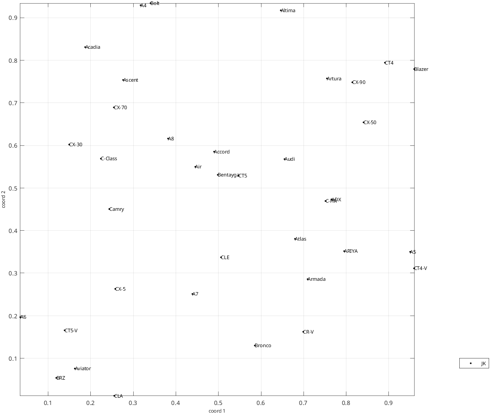
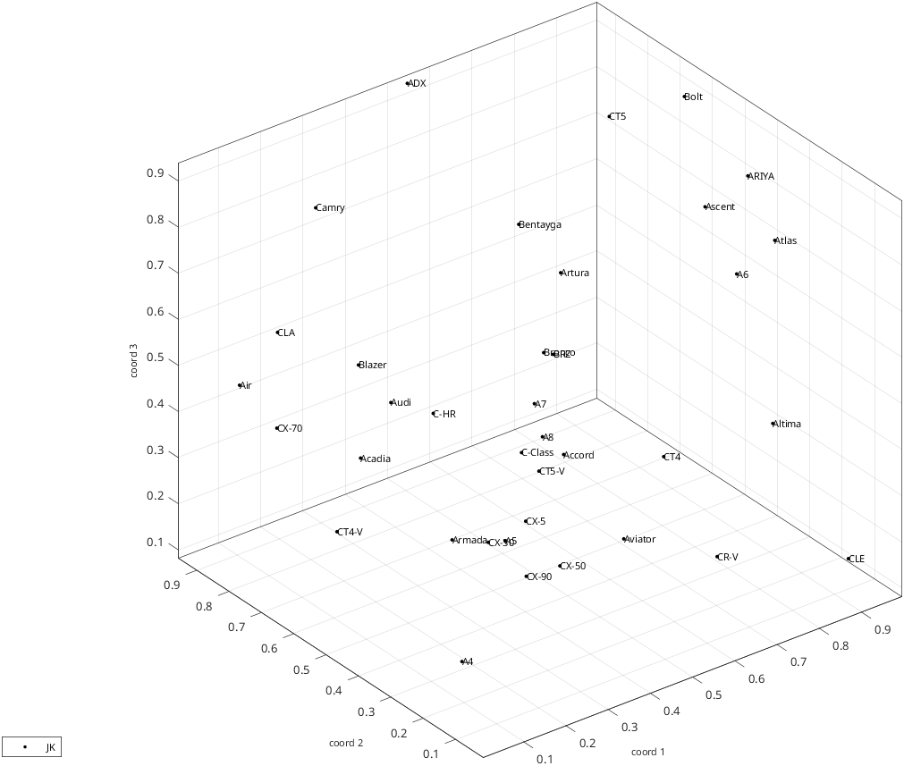
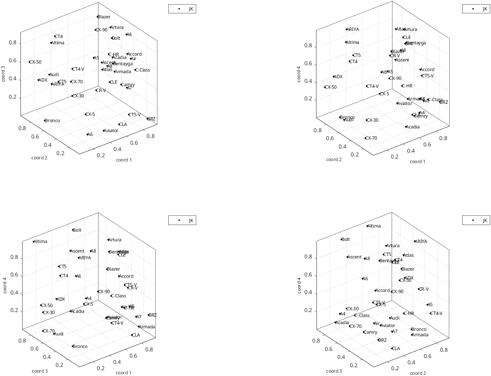

# rs_disp_coordsets_demo_cars
Display datasets in an unstrucured domain (no stimulus coordinates)

Normally 'data_out' is already in the workspace, having been created by
rs_read_coorddata_demo_cars. If it is not, that demo is run first, so that this script can
also be run standalone.

See also:  [rs_disp_coordsets](rs_disp_coordsets.md), [rs_read_coorddata_demo_cars](rs_read_coorddata_demo_cars.md)

```matlab
if ~exist('data_out')
    disp('no data found; running rs_read_coorddata_demo_cars');
    rs_read_coorddata_demo_cars;
end
aux=struct;
aux.opts_disp.set_labels=data_out.sets{1}.subj_id;
for idim=2:4
aux.opts_disp.dim_select=idim;
    rs_disp_coordsets(data_out,aux); %standard plots, each dimension available
end
```

Output:

```text
no data found; running rs_read_coorddata_demo_cars
 37 different stimulus types found in  data file demos/cars_coords_JK
 37 different stimulus types found in setup file [unused]
 37 of  37 labels found
coordinate sets with  1 to  4 dimensions read.
##### rs_warning: cannot find stimulus coordinates, so cannot identify rays

data_out = 

  <a href="matlab:helpPopup('struct')" style="font-weight:bold">struct</a> with fields:

      ds: {{1x4 cell}}
     sas: {[1x1 struct]}
    sets: {[1x1 struct]}


aux_out = 

  <a href="matlab:helpPopup('struct')" style="font-weight:bold">struct</a> with fields:

             warnings: 'cannot find stimulus coordinates, so cannot identify rays'
             warn_bad: 0
              if_warn: 1
          warn_leadin: '##### rs_warning: '
    if_warn_traceback: 0
           opts_check: [1x1 struct]
            opts_read: {[1x1 struct]}
            opts_rays: {[1x1 struct]}
                rayss: {[1x1 struct]}
           opts_qpred: {[1x1 struct]}
            syms_list: [1x1 struct]

 
ds{1}: coordinate structure
    {37x1 double}    {37x2 double}    {37x3 double}    {37x4 double}

 
sas{1}: stimulus metadata structure
           nstims: 37
        typenames: {37x1 cell}
    btc_specoords: []
      type_coords: []
    paradigm_name: 'cars'
       sigma_orig: 1
       sigma_info: 'coordinates have been normalized to sigma=1'

 
sets{1}: set metadata structure
             type: 'data'
    paradigm_type: 'transport'
    paradigm_name: 'cars'
          subj_id: 'JK'
    subj_id_short: 'JK'
            extra: []
         dim_list: [1 2 3 4]
           nstims: 37
       label_long: 'demos/cars_coords_JK'
            label: 'demos/cars_JK'
         pipeline: [1x1 struct]
```





