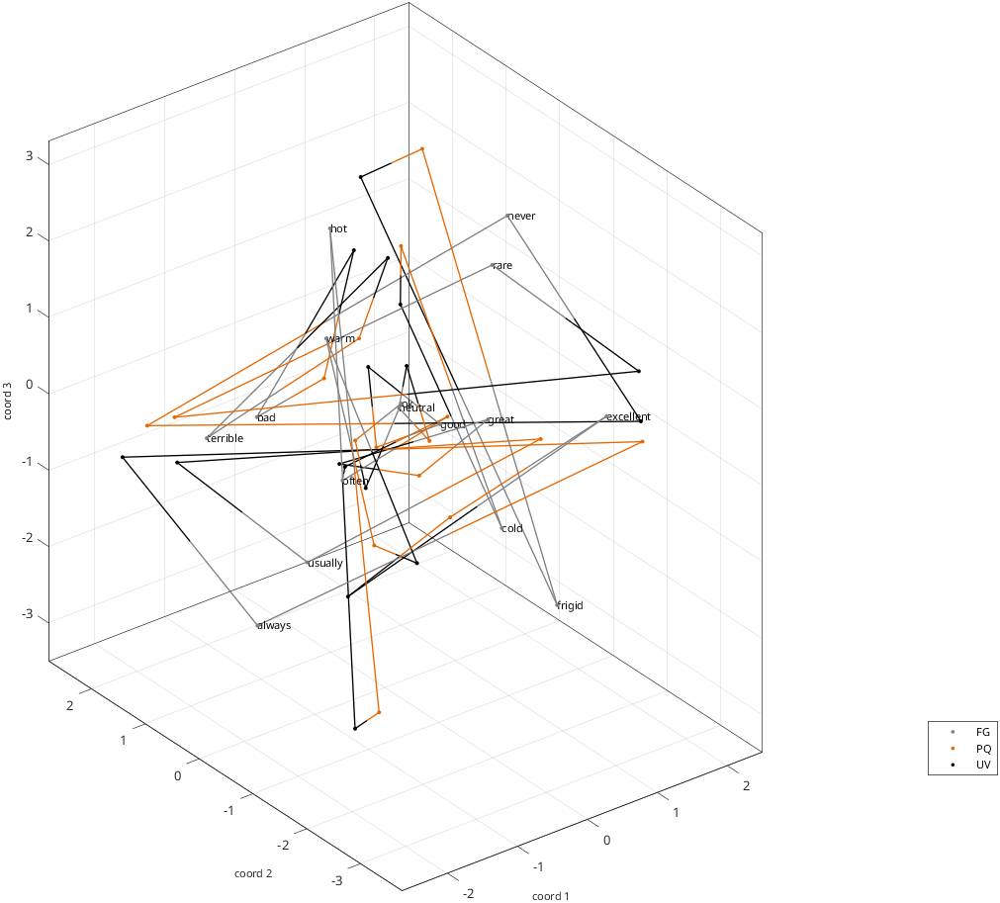
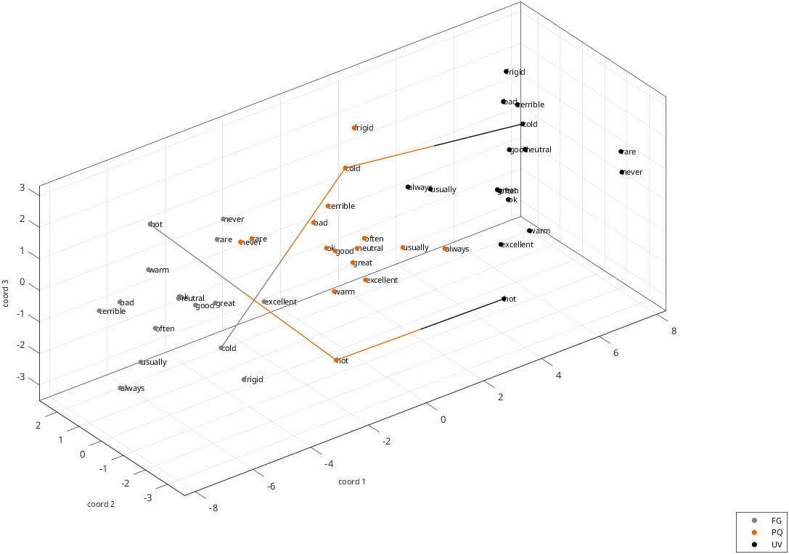
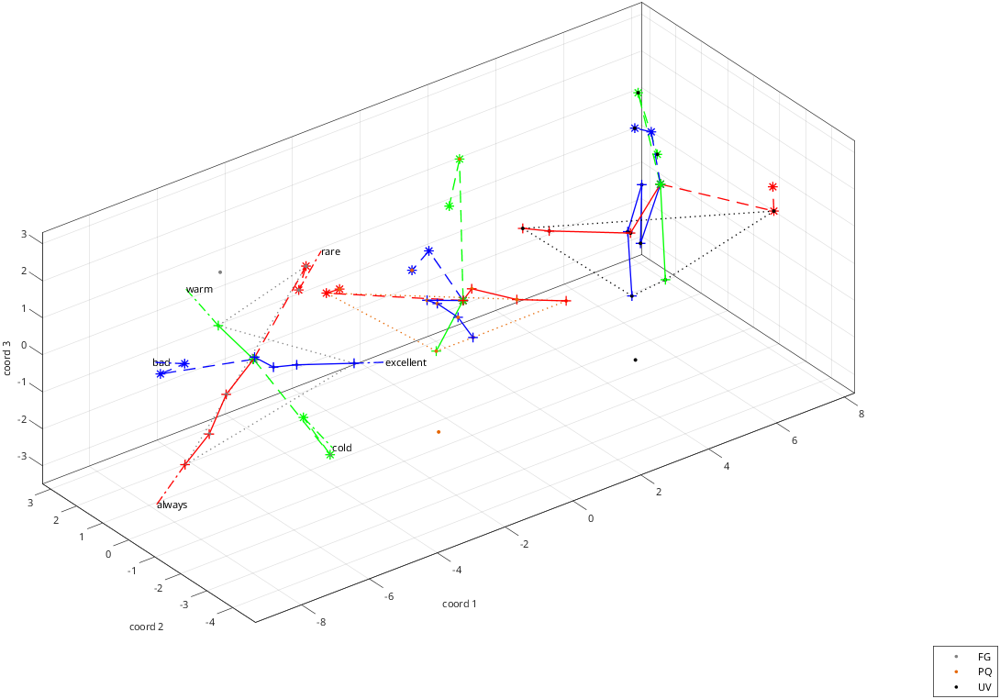
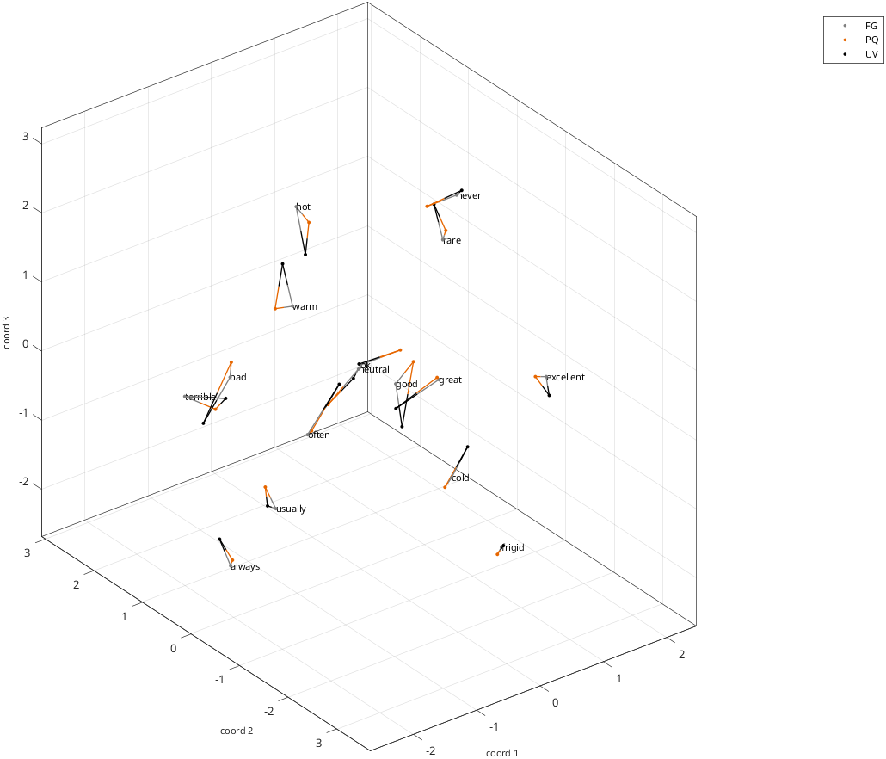
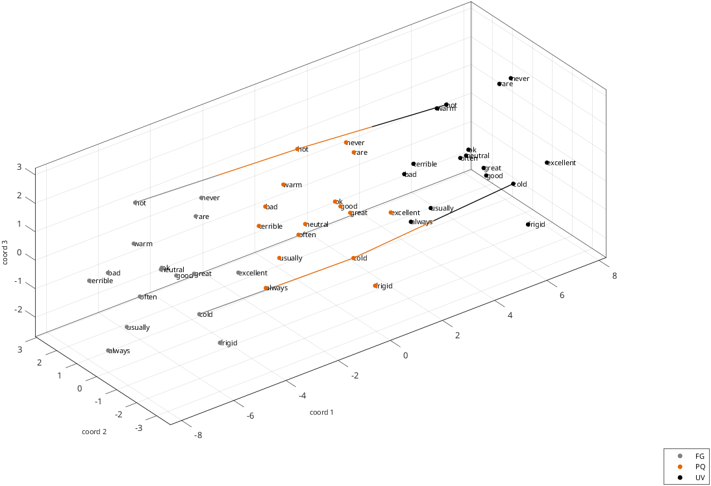
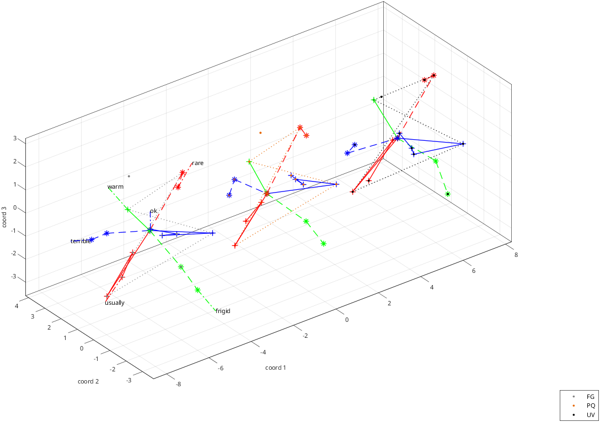
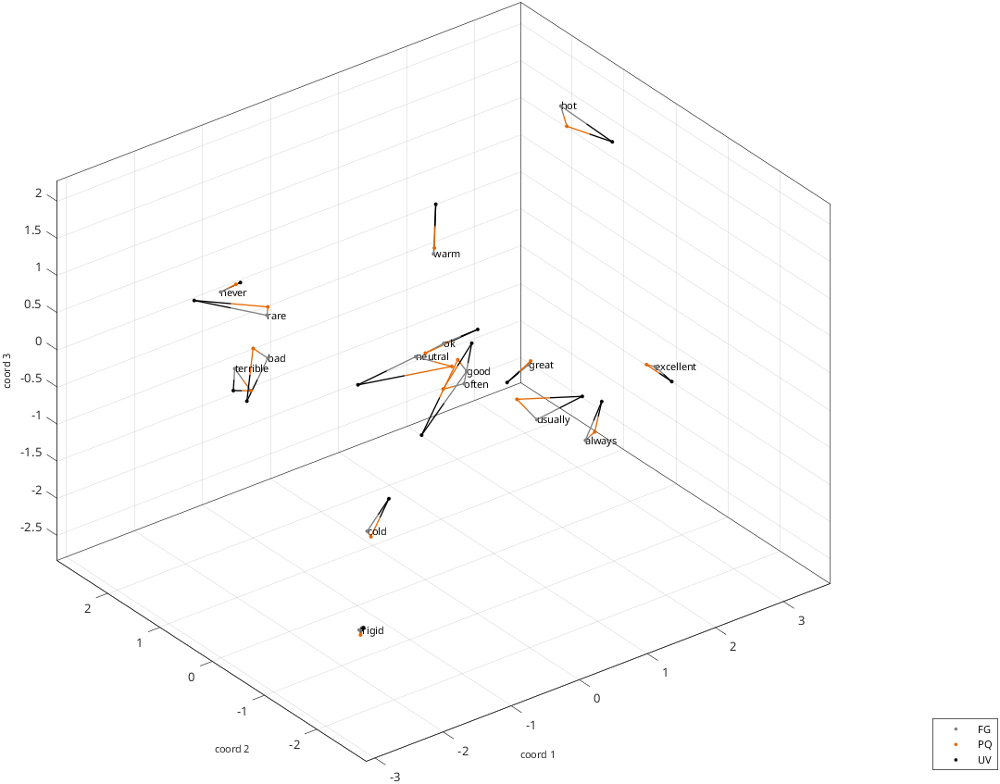
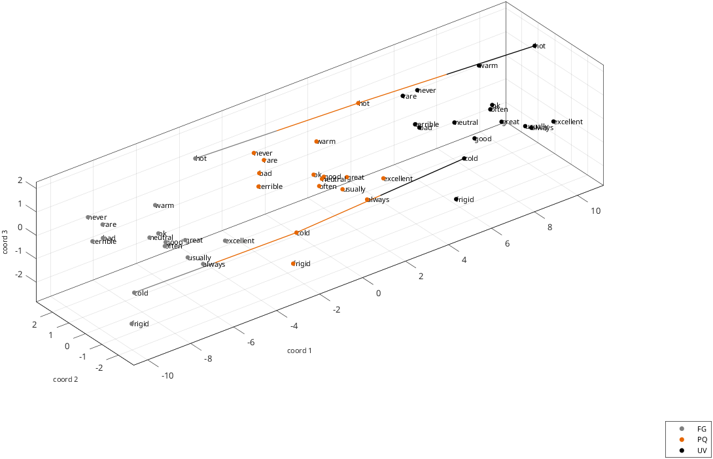
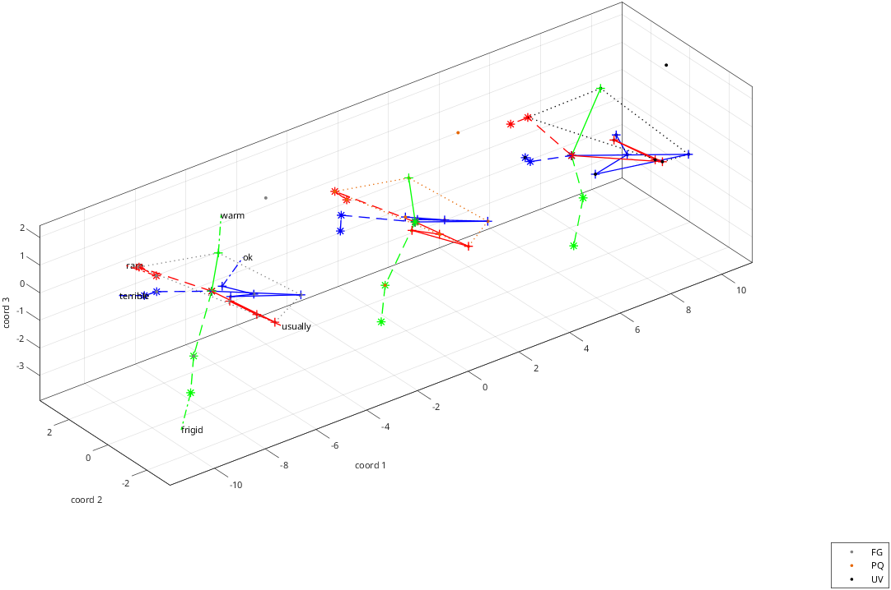

# rs_disp_coordsets_demo_opposites
Display datasets in a structured domain (stimulus coordinates and rays)

Normally 'data_out', 'aux_out' and 'nfiles' are already in the workspace, having been
created by rs_read_coorddata_demo_opposites. If they are not, that demo is run first,
reading the three built-in coordinate files, so that this script can also be run
standalone.

See also:  [rs_disp_coordsets](rs_disp_coordsets.md), [rs_read_coorddata_demo_opposites](rs_read_coorddata_demo_opposites.md)

```matlab
if ~exist('data_out') | ~exist('aux_out') | ~exist('nfiles')
    disp('no data found; running rs_read_coorddata_demo_opposites');
    which_read=1; %read the three coordinate files sequentially
    if_builtin=1; %use the built-in file names
    rs_read_coorddata_demo_opposites;
end
dim_list=getinp('dimension list','d',[2 3],3);
aux_disp=struct;
for ifile=1:nfiles %label each dataset by subject ID
    aux_disp.opts_disp.set_labels{ifile}=data_out.sets{ifile}.subj_id;
end
aux_disp.opts_disp.set_colors={[0.5 0.5 0.5],[0.9 0.4 0],[0 0 0]}; %custom colors for the datasets
```

Output:

```text
no data found; running rs_read_coorddata_demo_opposites
1-> read data files sequentially with rs_read_coorddata
2-> read several data files at once with rs_get_coordsets
3-> read several datasets created with quadratic form models with rs_get_coordsets
4-> read mix of data files and datasets created with quadratic form models with rs_get_coordsets
 16 different stimulus types found in  data file demos/opposites_coords_FG
 16 different stimulus types found in setup file [unused]
 16 of  16 labels found
coordinate sets with  1 to  3 dimensions read.
 16 different stimulus types found in  data file demos/opposites_coords_PQ
 16 different stimulus types found in setup file [unused]
 16 of  16 labels found
coordinate sets with  1 to  3 dimensions read.
 16 different stimulus types found in  data file demos/opposites_coords_UV
 16 different stimulus types found in setup file [unused]
 16 of  16 labels found
coordinate sets with  1 to  3 dimensions read.

data_out = 

  <a href="matlab:helpPopup('struct')" style="font-weight:bold">struct</a> with fields:

      ds: {{1x3 cell}  {1x3 cell}  {1x3 cell}}
     sas: {[1x1 struct]  [1x1 struct]  [1x1 struct]}
    sets: {[1x1 struct]  [1x1 struct]  [1x1 struct]}

can now display with rs_disp_coordsets_demo_opposites
Enter dimension list (range: 2 to 3, default= 3):3
```

```matlab
aux_disp1=aux_disp;
aux_disp1.opts_disp.connect_sets_method='all'; %connect datasets
```

```matlab
aux_disp2=aux_disp;
aux_disp2.opts_disp.set_markersizes=16; %larger markers
aux_disp2.opts_disp.data_label_setsel_method='all'; %label all sets
aux_disp2.opts_disp.set_offsets='margin_amount'; %how to space between datasets
aux_disp2.opts_disp.set_offsets_coordchoices=1; %offset along coordinate 1
aux_disp2.opts_disp.connect_sets_method='chain'; %connect set 1 to 2, and 2 to 3
aux_disp2.opts_disp.connect_sets_data_method='list';  %label all sets
```

```matlab
aux_disp3=aux_disp;
aux_disp3.opts_disp.set_offsets='margin_amount'; %how to space between datasets
aux_disp3.opts_disp.set_offsets_coordchoices=1; %offset along coordinate 1
aux_disp3.opts_disp_enh.if_rings=1;
aux_disp3.opts_disp_enh.if_nbrs=0;
aux_disp3.opts_disp_enh.if_usetypenames=0; %use coordinate values rather than typenames to color
```

```matlab
rays=aux_out{1}.rayss{1};
```

knit by Procrustes

```matlab
opts_knit=struct;
aux_knit=struct;
aux_knit.opts_knit=opts_knit;
[data_knit,aux_knit_out]=rs_knit_coordsets(data_out,aux_knit); %align stimuli via Procrustes; stimuli will be reordered alphabetically
rays_knit=aux_knit_out.rayss{1}; %stimuli will be reordered by knitting, so rays need to be recalculated
data_aligned=aux_knit_out.components; %
```

Output:

```text
 number of stimuli missing in dataset   1:    0
 number of stimuli missing in dataset   2:    0
 number of stimuli missing in dataset   3:    0
data table
    16    16    16
    16    16    16
    16    16    16

sa_pooled and data_align will be created.
NaN removal attempted with  3 datasets
 set   1: stimuli:  16, type       data, label demos/opposites_FG
 set   2: stimuli:  16, type       data, label demos/opposites_PQ
 set   3: stimuli:  16, type       data, label demos/opposites_UV
 unique typenames:  16
proceeding with alignment of   3 datasets, paradigm type opposites, stimuli must be present in 1
alignments attempted with  3 datasets
 set   1: stimuli:  16, type       data, label demos/opposites_FG
 set   2: stimuli:  16, type       data, label demos/opposites_PQ
 set   3: stimuli:  16, type       data, label demos/opposites_UV
 unique typenames:  16
 typenames present in at least  1 datasets:  16
if_type_coords_remake=0 (determined from metadata)
knitting  16 stimuli across   3 datasets, dimensions   1  2  3
  allow reflection: 1, allow offset: 1, allow scale: 0, normalize scale: 0, rotate to pcs: 0
 calculations with allow_scale=0, if_normscale=0
 set  1: created shuffles for  16 stimuli
 set  2: created shuffles for  16 stimuli
 set  3: created shuffles for  16 stimuli
 creating Procrustes consensus from dim  1 to dim  1 based on component datasets, iterations:    2, final total rms dev per coordinate:  0.39150
 creating Procrustes consensus from dim  2 to dim  2 based on component datasets, iterations:    3, final total rms dev per coordinate:  0.42767
 creating Procrustes consensus from dim  3 to dim  3 based on component datasets, iterations:    3, final total rms dev per coordinate:  0.34850
```

knit by Procrustes and then pca

```matlab
aux_knit_pca=aux_knit;
aux_knit_pca.opts_knit=setfield(opts_knit,'if_pca',1);
[data_knit_pca,aux_knit_out_pca]=rs_knit_coordsets(data_out,aux_knit_pca); %align stimuli via Procrustes and apply pca
data_aligned_pca=aux_knit_out_pca.components;
for plot_type=1:3
    switch plot_type
        case 1
            prefix='raw';
            data_disp=data_out;
            rays_disp=rays;
        case 2
            prefix='knit: procrustes only';
            data_disp=aux_knit_out.components;
            rays_disp=rays_knit;
        case 3
            prefix='knit: procrustes and PCA';
            data_disp=aux_knit_out_pca.components;
            rays_disp=rays_knit;
    end
    for idim=dim_list
        aux_disp1.opts_disp.dim_select=idim;
        aux_disp1.opts_disp.fig_name=sprintf('%s, dim %1.0f: superimpose, connect all stims, all sets',prefix,idim);
        rs_disp_coordsets(data_disp,aux_disp1); %standard plots, superimposed and connected
```

```matlab
        aux_disp2.opts_disp.dim_select=idim;
        aux_disp2.opts_disp.fig_name=sprintf('%s dim %1.0f: separate, connect one stim as a chain',prefix,idim);
        data_connect_ptrs=union(strmatch('hot',data_disp.sas{1}.typenames,'exact'),strmatch('cold',data_disp.sas{1}.typenames,'exact'));
        aux_disp2.opts_disp.connect_sets_data_list=data_connect_ptrs; %just connect the points labeled hot and cold
        rs_disp_coordsets(data_disp,aux_disp2); %standard plots, spaced along second dimension
```

```matlab
        aux_disp3.opts_disp.dim_select=idim;
        aux_disp3.opts_disp.fig_name=sprintf('%s dim %1.0f: separate, show rays',prefix,idim);
        rs_disp_enh_coordsets(data_disp,aux_disp3,rays_disp); %enhanced plots with rays and rings
    end
end %plot_type
```

Output:

```text
 number of stimuli missing in dataset   1:    0
 number of stimuli missing in dataset   2:    0
 number of stimuli missing in dataset   3:    0
data table
    16    16    16
    16    16    16
    16    16    16

sa_pooled and data_align will be created.
NaN removal attempted with  3 datasets
 set   1: stimuli:  16, type       data, label demos/opposites_FG
 set   2: stimuli:  16, type       data, label demos/opposites_PQ
 set   3: stimuli:  16, type       data, label demos/opposites_UV
 unique typenames:  16
proceeding with alignment of   3 datasets, paradigm type opposites, stimuli must be present in 1
alignments attempted with  3 datasets
 set   1: stimuli:  16, type       data, label demos/opposites_FG
 set   2: stimuli:  16, type       data, label demos/opposites_PQ
 set   3: stimuli:  16, type       data, label demos/opposites_UV
 unique typenames:  16
 typenames present in at least  1 datasets:  16
if_type_coords_remake=0 (determined from metadata)
knitting  16 stimuli across   3 datasets, dimensions   1  2  3
  allow reflection: 1, allow offset: 1, allow scale: 0, normalize scale: 0, rotate to pcs: 1
 calculations with allow_scale=0, if_normscale=0
 set  1: created shuffles for  16 stimuli
 set  2: created shuffles for  16 stimuli
 set  3: created shuffles for  16 stimuli
 creating Procrustes consensus from dim  1 to dim  1 based on component datasets, iterations:    2, final total rms dev per coordinate:  0.39150
 creating Procrustes consensus from dim  2 to dim  2 based on component datasets, iterations:    3, final total rms dev per coordinate:  0.42767
 creating Procrustes consensus from dim  3 to dim  3 based on component datasets, iterations:    3, final total rms dev per coordinate:  0.34850
```

















