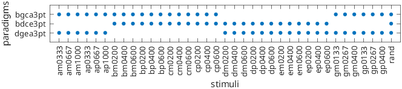
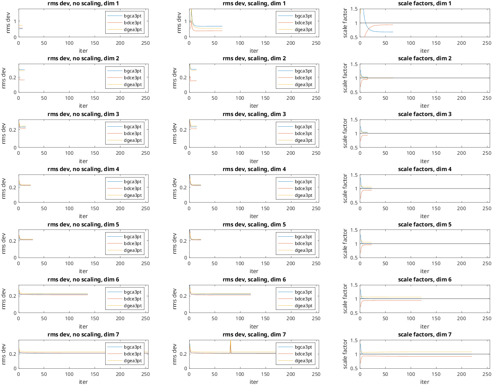
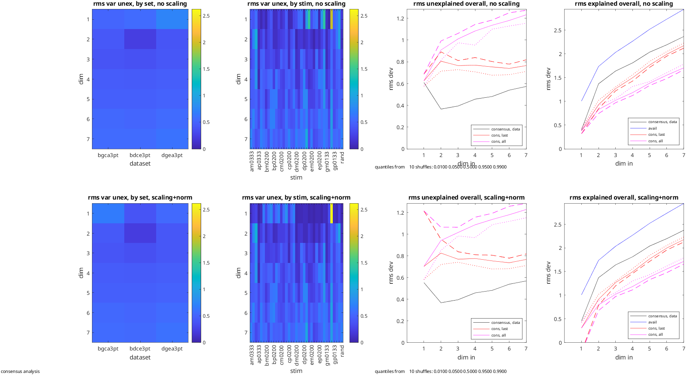

# rs_knit_coordsets_demo
Combine coordinate sets with partially overlapping stimuli

calculates statistics, without and with scaling allowed between datasets
plots both sets of stats on same figure , adjusting dataset and stimulus names

See also:  [rs_knit_coordsets](rs_knit_coordsets.md), [rs_align_coordsets](rs_align_coordsets.md)

```matlab
verbosity=getinp('pipeline display verbosity','d',[0 2],0);
if_write=getinp('1 to write the knitted sets','d',[0 1]);
nshuffs=getinp('number of shuffles for statistics (0 for none)','d',[0 1000],10);
```

Output:

```text
Enter pipeline display verbosity (range: 0 to 2, default= 0):0
Enter 1 to write the knitted sets (range: 0 to 1):0
Enter number of shuffles for statistics (0 for none) (range: 0 to 1000, default= 10):10
```

section to force btc defaults, even if rs_aux_defaults.mat has been created or modified

```matlab
if ~exist('aux_force_filename') aux_force_filename='rs_aux_defaults_btc.mat'; end
auxs_force=struct;
opts_needed={'opts_read','opts_rays','opts_check','opts_align','opts_import','opts_qpred','opts_knit','opts_write'};
for k=1:length(opts_needed)
    auxs_force.(opts_needed{k})=rs_aux_force(opts_needed{k},[],aux_force_filename);
end
```

```matlab
filenames={'./samples/bwtextures/bgca3pt_coords_MC_sess01_10.mat','./samples/bwtextures/bdce3pt_coords_MC_sess01_10.mat','./samples/bwtextures/dgea3pt_coords_MC_sess01_10.mat'};
nsets=length(filenames);
aux=auxs_force;
aux.nsets=nsets;
aux.opts_align.min=1;
aux.opts_read=setfields(auxs_force.opts_read,{'input_type','if_auto','if_log'},{1,1,1});
aux.opts_knit.keep_details=1;
```

read the data

```matlab
[data_read,aux_read]=rs_get_coordsets(filenames,aux);
```

Output:

```text
 
 entering set  1 of  3:
primary dataset 1 is experimental data
 25 different stimulus types found in  data file ./samples/bwtextures/bgca3pt_coords_MC_sess01_10.mat
suggested ray permutation for bgca:
     2     1     3     4

 25 different stimulus types found in setup file ./samples/bwtextures/bgca3pt9.mat
 25 of  25 labels found
coordinate sets with  1 to  7 dimensions read.
 
 entering set  2 of  3:
primary dataset 2 is experimental data
 25 different stimulus types found in  data file ./samples/bwtextures/bdce3pt_coords_MC_sess01_10.mat
suggested ray permutation for bdce:
     1     3     2     4

 25 different stimulus types found in setup file ./samples/bwtextures/bdce3pt9.mat
 25 of  25 labels found
coordinate sets with  1 to  7 dimensions read.
warning: the following stimulus type names do not match in dataset 2 (primary: 2):
   for stim   4, expecting               gp0133 found               dp0200 , stim not present at all
   for stim   5, expecting               gp0267 found               dp0400 , stim not present at all
   for stim   6, expecting               gp0400 found               dp0600 , stim not present at all
   for stim  10, expecting               ap0333 found               ep0200 , stim not present at all
   for stim  11, expecting               ap0667 found               ep0400 , stim not present at all
   for stim  12, expecting               ap1000 found               ep0600 , stim not present at all
   for stim  16, expecting               gm0133 found               dm0200 , stim not present at all
   for stim  17, expecting               gm0267 found               dm0400 , stim not present at all
   for stim  18, expecting               gm0400 found               dm0600 , stim not present at all
   for stim  22, expecting               am0333 found               em0200 , stim not present at all
   for stim  23, expecting               am0667 found               em0400 , stim not present at all
   for stim  24, expecting               am1000 found               em0600 , stim not present at all
 
 entering set  3 of  3:
primary dataset 3 is experimental data
 25 different stimulus types found in  data file ./samples/bwtextures/dgea3pt_coords_MC_sess01_10.mat
suggested ray permutation for dgea:
     2     1     3     4

 25 different stimulus types found in setup file ./samples/bwtextures/dgea3pt9.mat
 25 of  25 labels found
coordinate sets with  1 to  7 dimensions read.
warning: the following stimulus type names do not match in dataset 3 (primary: 3):
   for stim   1, expecting               bp0200 found               dp0200 , stim not present at all
   for stim   2, expecting               bp0400 found               dp0400 , stim not present at all
   for stim   3, expecting               bp0600 found               dp0600 , stim not present at all
   for stim   7, expecting               cp0200 found               ep0200 , stim not present at all
   for stim   8, expecting               cp0400 found               ep0400 , stim not present at all
   for stim   9, expecting               cp0600 found               ep0600 , stim not present at all
   for stim  13, expecting               bm0200 found               dm0200 , stim not present at all
   for stim  14, expecting               bm0400 found               dm0400 , stim not present at all
   for stim  15, expecting               bm0600 found               dm0600 , stim not present at all
   for stim  19, expecting               cm0200 found               em0200 , stim not present at all
   for stim  20, expecting               cm0400 found               em0400 , stim not present at all
   for stim  21, expecting               cm0600 found               em0600 , stim not present at all
 
datasets selected:
 set  1: dim range [  1   7] label: samples/bwtextures/bgca3pt_MC_sess01_10
 set  2: dim range [  1   7] label: samples/bwtextures/bdce3pt_MC_sess01_10
 set  3: dim range [  1   7] label: samples/bwtextures/dgea3pt_MC_sess01_10
```

align

```matlab
[data_align,aux_align]=rs_align_coordsets(data_read,aux);
```

Output:

```text
 set   1: simplification attempted,   0 coords simplified (label: samples/bwtextures/bgca3pt_MC_sess01_10)
 set   2: simplification attempted,   0 coords simplified (label: samples/bwtextures/bdce3pt_MC_sess01_10)
 set   3: simplification attempted,   0 coords simplified (label: samples/bwtextures/dgea3pt_MC_sess01_10)
proceeding with alignment of   3 datasets, paradigm type btc, stimuli must be present in 1
alignments attempted with  3 datasets
 set   1: stimuli:  25, type       data, label samples/bwtextures/bgca3pt_MC_sess01_10
 set   2: stimuli:  25, type       data, label samples/bwtextures/bdce3pt_MC_sess01_10
 set   3: stimuli:  25, type       data, label samples/bwtextures/dgea3pt_MC_sess01_10
 unique typenames:  37
 typenames present in at least  1 datasets:  37
if_type_coords_remake=0 (determined from metadata)
```

knit

```matlab
[data_knit,aux_knit]=rs_knit_coordsets(data_align,aux);
```

Output:

```text
 number of stimuli missing in dataset   1:   12
 number of stimuli missing in dataset   2:   12
 number of stimuli missing in dataset   3:   12
data table
    25    13    13
    13    25    13
    13    13    25

sa_pooled and data_align will be created.
NaN removal attempted with  3 datasets
 set   1: stimuli:  37, type       data, label samples/bwtextures/bgca3pt_MC_sess01_10
 set   2: stimuli:  37, type       data, label samples/bwtextures/bdce3pt_MC_sess01_10
 set   3: stimuli:  37, type       data, label samples/bwtextures/dgea3pt_MC_sess01_10
 unique typenames:  37
 set   1: simplification attempted,   0 coords simplified (label: samples/bwtextures/bgca3pt_MC_sess01_10)
 set   2: simplification attempted,   0 coords simplified (label: samples/bwtextures/bdce3pt_MC_sess01_10)
 set   3: simplification attempted,   0 coords simplified (label: samples/bwtextures/dgea3pt_MC_sess01_10)
proceeding with alignment of   3 datasets, paradigm type btc, stimuli must be present in 1
alignments attempted with  3 datasets
 set   1: stimuli:  25, type       data, label samples/bwtextures/bgca3pt_MC_sess01_10
 set   2: stimuli:  25, type       data, label samples/bwtextures/bdce3pt_MC_sess01_10
 set   3: stimuli:  25, type       data, label samples/bwtextures/dgea3pt_MC_sess01_10
 unique typenames:  37
 typenames present in at least  1 datasets:  37
if_type_coords_remake=0 (determined from metadata)
knitting  37 stimuli across   3 datasets, dimensions   1  2  3  4  5  6  7
  allow reflection: 1, allow offset: 1, allow scale: 0, normalize scale: 0, rotate to pcs: 0
 calculations with allow_scale=0, if_normscale=0
 set  1: created shuffles for  25 stimuli
 set  2: created shuffles for  25 stimuli
 set  3: created shuffles for  25 stimuli
 creating Procrustes consensus from dim  1 to dim  1 based on component datasets, iterations:    8, final total rms dev per coordinate:  1.05588
 creating Procrustes consensus from dim  2 to dim  2 based on component datasets, iterations:   12, final total rms dev per coordinate:  0.44757
 creating Procrustes consensus from dim  3 to dim  3 based on component datasets, iterations:   14, final total rms dev per coordinate:  0.39385
 creating Procrustes consensus from dim  4 to dim  4 based on component datasets, iterations:   24, final total rms dev per coordinate:  0.39563
 creating Procrustes consensus from dim  5 to dim  5 based on component datasets, iterations:   28, final total rms dev per coordinate:  0.37277
 creating Procrustes consensus from dim  6 to dim  6 based on component datasets, iterations:  136, final total rms dev per coordinate:  0.38140
 creating Procrustes consensus from dim  7 to dim  7 based on component datasets, iterations:  255, final total rms dev per coordinate:  0.37534
```

also knit with allowing a scaling between datasets

```matlab
aux_allowscale=aux;
aux_allowscale.opts_knit.allow_scale=1;
aux_allowscale.opts_knit.if_normscale=1;
[data_knit_allowscale,aux_knit_allowscale]=rs_knit_coordsets(data_align,aux_allowscale);
```

Output:

```text
 number of stimuli missing in dataset   1:   12
 number of stimuli missing in dataset   2:   12
 number of stimuli missing in dataset   3:   12
data table
    25    13    13
    13    25    13
    13    13    25

sa_pooled and data_align will be created.
NaN removal attempted with  3 datasets
 set   1: stimuli:  37, type       data, label samples/bwtextures/bgca3pt_MC_sess01_10
 set   2: stimuli:  37, type       data, label samples/bwtextures/bdce3pt_MC_sess01_10
 set   3: stimuli:  37, type       data, label samples/bwtextures/dgea3pt_MC_sess01_10
 unique typenames:  37
 set   1: simplification attempted,   0 coords simplified (label: samples/bwtextures/bgca3pt_MC_sess01_10)
 set   2: simplification attempted,   0 coords simplified (label: samples/bwtextures/bdce3pt_MC_sess01_10)
 set   3: simplification attempted,   0 coords simplified (label: samples/bwtextures/dgea3pt_MC_sess01_10)
proceeding with alignment of   3 datasets, paradigm type btc, stimuli must be present in 1
alignments attempted with  3 datasets
 set   1: stimuli:  25, type       data, label samples/bwtextures/bgca3pt_MC_sess01_10
 set   2: stimuli:  25, type       data, label samples/bwtextures/bdce3pt_MC_sess01_10
 set   3: stimuli:  25, type       data, label samples/bwtextures/dgea3pt_MC_sess01_10
 unique typenames:  37
 typenames present in at least  1 datasets:  37
if_type_coords_remake=0 (determined from metadata)
knitting  37 stimuli across   3 datasets, dimensions   1  2  3  4  5  6  7
  allow reflection: 1, allow offset: 1, allow scale: 1, normalize scale: 1, rotate to pcs: 0
 calculations with allow_scale=1, if_normscale=1
 set  1: created shuffles for  25 stimuli
 set  2: created shuffles for  25 stimuli
 set  3: created shuffles for  25 stimuli
 creating Procrustes consensus from dim  1 to dim  1 based on component datasets, iterations:   65, final total rms dev per coordinate:  0.95566
 creating Procrustes consensus from dim  2 to dim  2 based on component datasets, iterations:   14, final total rms dev per coordinate:  0.44842
 creating Procrustes consensus from dim  3 to dim  3 based on component datasets, iterations:   15, final total rms dev per coordinate:  0.39404
 creating Procrustes consensus from dim  4 to dim  4 based on component datasets, iterations:   23, final total rms dev per coordinate:  0.39562
 creating Procrustes consensus from dim  5 to dim  5 based on component datasets, iterations:   23, final total rms dev per coordinate:  0.37207
 creating Procrustes consensus from dim  6 to dim  6 based on component datasets, iterations:  121, final total rms dev per coordinate:  0.37976
 creating Procrustes consensus from dim  7 to dim  7 based on component datasets, iterations:  220, final total rms dev per coordinate:  0.37148
```

show pipelines, also expanding the contents of sets and sets_combined

```matlab
if verbosity<=1
    fields_expand={};
else
    fields_expand={'opts','file_list','sets','sets_combined'};
end
disp('%%%%%%%%%%%%%%%%%%%');
disp('pipeline for knitted dataset, no scaling');
rs_showpipeline(data_knit.sets{1}.pipeline,setfields(struct(),{'fields_expand','verbosity'},{fields_expand,verbosity}));
disp('%%%%%%%%%%%%%%%%%%%');
```

Output:

```text
%%%%%%%%%%%%%%%%%%%
pipeline for knitted dataset, no scaling
 depth 0, type knit
 
examining pipeline at depth 1 of sets_combined: entry  1 of  3
      depth 1, type align
     examining pipeline at depth 2 of sets: entry  1 of  1-> empty
     examining pipeline at depth 2 of sets_combined: entry  1 of  3-> empty
     examining pipeline at depth 2 of sets_combined: entry  2 of  3-> empty
     examining pipeline at depth 2 of sets_combined: entry  3 of  3-> empty
 
examining pipeline at depth 1 of sets_combined: entry  2 of  3
      depth 1, type align
     examining pipeline at depth 2 of sets: entry  1 of  1-> empty
     examining pipeline at depth 2 of sets_combined: entry  1 of  3-> empty
     examining pipeline at depth 2 of sets_combined: entry  2 of  3-> empty
     examining pipeline at depth 2 of sets_combined: entry  3 of  3-> empty
 
examining pipeline at depth 1 of sets_combined: entry  3 of  3
      depth 1, type align
     examining pipeline at depth 2 of sets: entry  1 of  1-> empty
     examining pipeline at depth 2 of sets_combined: entry  1 of  3-> empty
     examining pipeline at depth 2 of sets_combined: entry  2 of  3-> empty
     examining pipeline at depth 2 of sets_combined: entry  3 of  3-> empty
%%%%%%%%%%%%%%%%%%%
```

```matlab
disp('pipeline for knitted dataset, scaling');
rs_showpipeline(data_knit_allowscale.sets{1}.pipeline,setfields(struct(),{'fields_expand','verbosity'},{fields_expand,verbosity}));
disp('%%%%%%%%%%%%%%%%%%%');
```

Output:

```text
pipeline for knitted dataset, scaling
 depth 0, type knit
 
examining pipeline at depth 1 of sets_combined: entry  1 of  3
      depth 1, type align
     examining pipeline at depth 2 of sets: entry  1 of  1-> empty
     examining pipeline at depth 2 of sets_combined: entry  1 of  3-> empty
     examining pipeline at depth 2 of sets_combined: entry  2 of  3-> empty
     examining pipeline at depth 2 of sets_combined: entry  3 of  3-> empty
 
examining pipeline at depth 1 of sets_combined: entry  2 of  3
      depth 1, type align
     examining pipeline at depth 2 of sets: entry  1 of  1-> empty
     examining pipeline at depth 2 of sets_combined: entry  1 of  3-> empty
     examining pipeline at depth 2 of sets_combined: entry  2 of  3-> empty
     examining pipeline at depth 2 of sets_combined: entry  3 of  3-> empty
 
examining pipeline at depth 1 of sets_combined: entry  3 of  3
      depth 1, type align
     examining pipeline at depth 2 of sets: entry  1 of  1-> empty
     examining pipeline at depth 2 of sets_combined: entry  1 of  3-> empty
     examining pipeline at depth 2 of sets_combined: entry  2 of  3-> empty
     examining pipeline at depth 2 of sets_combined: entry  3 of  3-> empty
%%%%%%%%%%%%%%%%%%%
```

```matlab
dim_list=data_knit.sets{1}.dim_list; %list of dimensions of coordinate sets
paradigm_names=cell(1,nsets); %retrieve paradigm names
for iset=1:nsets
    paradigm_names{iset}=data_read.sets{iset}.paradigm_name;
end
```

show which paradigms contain which stimuli

```matlab
figure;
spy(aux_knit.coords_havedata');
nstims=data_knit.sas{1}.nstims;
typenames=data_knit.sas{1}.typenames;
xlabel('stimuli');
set(gca,'XTick',[1:nstims]);
set(gca,'XTickLabel',typenames);
ylabel('paradigms');
set(gca,'YTick',[1:nsets]);
set(gca,'YTickLabel',paradigm_names);
drawnow;
```



retrieve and plot convergence and scaling

```matlab
scalings=cell(1,max(dim_list));
rmsdev=cell(2,max(dim_list)); %d1 is 1 for standard, 2 for allow scale
niters=zeros(2,max(dim_list));
for idim=dim_list
    details=aux_knit.details{idim};
    details_as=aux_knit_allowscale.details{idim};
    niters(1,idim)=length(details.ts_cum);
    niters(2,idim)=length(details_as.ts_cum);
    rmsdev{1,idim}=details.rms_dev;
    rmsdev{2,idim}=details_as.rms_dev;
    scalings{idim}=ones(nsets,niters(idim));
    for iter=1:niters(2,idim)
        for iset=1:nsets           
            scalings{idim}(iset,iter)=details_as.ts_cum{iter}{iset}.scaling;
        end
    end
end
figure;
set(gcf,'Position',[100 100 1200 900]);
ncols=3;
ias_label={'no scaling','scaling'};
for idim=dim_list
```

```matlab
for ias=1:2
        subplot(max(dim_list),3,ncols*(idim-1)+ias)
        plot(rmsdev{ias,idim}');
        xlabel('iter');
        set(gca,'XLim',[0 max(niters(:))]);
        ylabel('rms dev');
        set(gca,'YLim',[0 max(max(rmsdev{1,idim}(:)),max(rmsdev{2,idim}(:)))]);
        title(sprintf('rms dev, %s, dim %1.0f',ias_label{ias},idim));
        legend(paradigm_names,'Location','NorthEast');
    end
    subplot(max(dim_list),3,ncols*(idim-1)+3)
    plot(scalings{idim}');
    xlabel('iter');
    set(gca,'XLim',[0 max(niters(:))]);
    ylabel('scale factor');
    set(gca,'YLim',[0.5 1.5]);
    hold on;
    plot([0 max(niters(:))],[1 1],'k');
    title(sprintf('scale factors, dim %1.0f',idim));
end
drawnow;
```



do statistics?

```matlab
if nshuffs>0
    aux_stats=aux;
    aux_stats.sa_pooled=aux_align.sa_pooled;
    aux_stats.data_align=data_align;
```

```matlab
aux_stats.opts_knit.if_stats=1;
    aux_stats.opts_knit.nshuffs=nshuffs;
    aux_stats.opts_knit.if_plot=0; %plot locally
```

knit and compute stats without allowing scaling between sets

```matlab
[data_knit_stats,aux_knit_stats]=rs_knit_coordsets(data_align,aux_stats);
```

knit and compute stats, allow scaling between sets;

```matlab
aux_allowscale_stats=aux_stats;
    aux_allowscale_stats.opts_knit.allow_scale=1;
    aux_allowscale_stats.opts_knit.if_normscale=1;
    [data_knit_allowscale_stats,aux_knit_allowscale_stats]=rs_knit_coordsets(data_align,aux_allowscale_stats);
```

make a combined plot

```matlab
fig_handle=figure;
    set(gcf,'Position',[100 100 1400 750]);
    set(gcf,'NumberTitle','off');
    knit_stats_setup=aux_knit_stats.knit_stats_setup;
    for k=1:length(knit_stats_setup.stimulus_labels) %thin stimulus labels
        if mod(k,3)~=1
            knit_stats_setup.stimulus_labels{k}='';
        end
    end
```

plot non-rescaled analysis

```matlab
aux_stats_replot=aux_stats;
```

```matlab
aux_stats_replot.knit_stats=aux_knit_stats.knit_stats;
```

```matlab
aux_stats_replot.knit_stats_setup=aux_knit_stats.knit_stats_setup;
    aux_stats_replot.knit_stats_setup.fig_handle=fig_handle;
    aux_stats_replot.knit_stats_setup.dataset_labels=paradigm_names;
    aux_stats_replot.knit_stats_setup.stimulus_labels=knit_stats_setup.stimulus_labels;
    aux_stats_replot.knit_stats_setup.nrows=2;
    aux_stats_replot.knit_stats_setup.row=1;
    [data_knit_stats,aux_knit_stats]=rs_knit_coordsets(data_align,aux_stats_replot);
```

plot rescaled analysis

```matlab
aux_stats_allowscale_replot=aux_stats_replot;
```

```matlab
aux_stats_allowscale_replot.knit_stats=aux_knit_allowscale_stats.knit_stats;
```

```matlab
aux_stats_allowscale_replot.knit_stats_setup.row=2;
```

```matlab
[data_knit_stats,aux_knit_stats]=rs_knit_coordsets(data_align,aux_stats_allowscale_replot);
end %nshuffs
```

Output:

```text
 number of stimuli missing in dataset   1:   12
 number of stimuli missing in dataset   2:   12
 number of stimuli missing in dataset   3:   12
data table
    25    13    13
    13    25    13
    13    13    25

sa_pooled and data_align are supplied.
knitting  37 stimuli across   3 datasets, dimensions   1  2  3  4  5  6  7
  allow reflection: 1, allow offset: 1, allow scale: 0, normalize scale: 0, rotate to pcs: 0
 calculations with allow_scale=0, if_normscale=0
 set  1: created shuffles for  25 stimuli
 set  2: created shuffles for  25 stimuli
 set  3: created shuffles for  25 stimuli
 creating Procrustes consensus from dim  1 to dim  1 based on component datasets, iterations:    8, final total rms dev per coordinate:  1.05588
 creating Procrustes consensus from dim  2 to dim  2 based on component datasets, iterations:   12, final total rms dev per coordinate:  0.44757
 creating Procrustes consensus from dim  3 to dim  3 based on component datasets, iterations:   14, final total rms dev per coordinate:  0.39385
 creating Procrustes consensus from dim  4 to dim  4 based on component datasets, iterations:   24, final total rms dev per coordinate:  0.39563
 creating Procrustes consensus from dim  5 to dim  5 based on component datasets, iterations:   28, final total rms dev per coordinate:  0.37277
 creating Procrustes consensus from dim  6 to dim  6 based on component datasets, iterations:  136, final total rms dev per coordinate:  0.38140
 creating Procrustes consensus from dim  7 to dim  7 based on component datasets, iterations:  255, final total rms dev per coordinate:  0.37534
 number of stimuli missing in dataset   1:   12
 number of stimuli missing in dataset   2:   12
 number of stimuli missing in dataset   3:   12
data table
    25    13    13
    13    25    13
    13    13    25

sa_pooled and data_align are supplied.
knitting  37 stimuli across   3 datasets, dimensions   1  2  3  4  5  6  7
  allow reflection: 1, allow offset: 1, allow scale: 1, normalize scale: 1, rotate to pcs: 0
 calculations with allow_scale=1, if_normscale=1
 set  1: created shuffles for  25 stimuli
 set  2: created shuffles for  25 stimuli
 set  3: created shuffles for  25 stimuli
 creating Procrustes consensus from dim  1 to dim  1 based on component datasets, iterations:   65, final total rms dev per coordinate:  0.95566
 creating Procrustes consensus from dim  2 to dim  2 based on component datasets, iterations:   14, final total rms dev per coordinate:  0.44842
 creating Procrustes consensus from dim  3 to dim  3 based on component datasets, iterations:   15, final total rms dev per coordinate:  0.39404
 creating Procrustes consensus from dim  4 to dim  4 based on component datasets, iterations:   23, final total rms dev per coordinate:  0.39562
 creating Procrustes consensus from dim  5 to dim  5 based on component datasets, iterations:   23, final total rms dev per coordinate:  0.37207
 creating Procrustes consensus from dim  6 to dim  6 based on component datasets, iterations:  121, final total rms dev per coordinate:  0.37976
 creating Procrustes consensus from dim  7 to dim  7 based on component datasets, iterations:  220, final total rms dev per coordinate:  0.37148
```



write datasets if requested

```matlab
if if_write
    aux.opts_write=auxs_force.opts_write;
    aux.opts_write.if_gui=0;
    aux_out_write=rs_write_coorddata('./demos/gbcdea3pt_coords_MC_noscale',data_knit,aux);
```

```matlab
aux_allowscale.opts_write=struct;
    aux_allowscale.opts_write.if_gui=0;
    aux_allowscale_out_write=rs_write_coorddata('./demos/gbcdea3pt_coords_MC_scale',data_knit_allowscale,aux_allowscale);
end
```