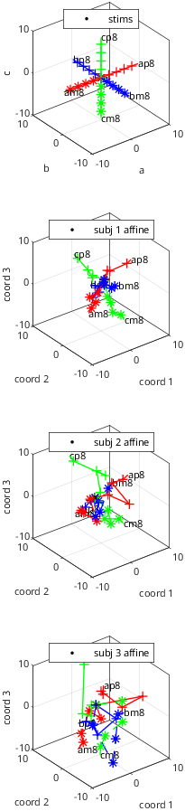
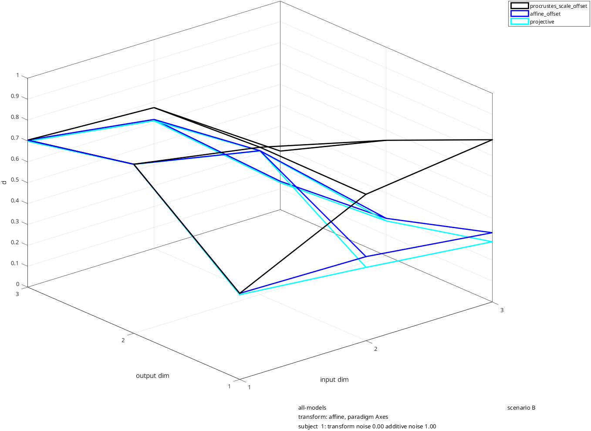
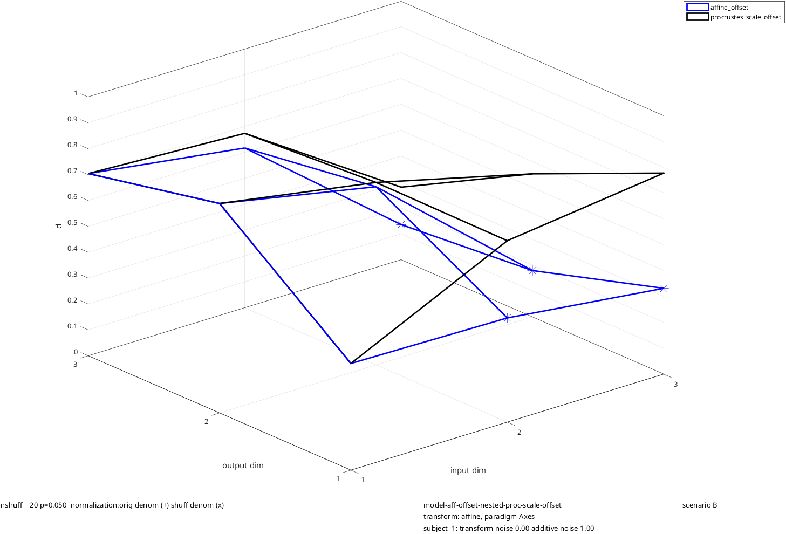
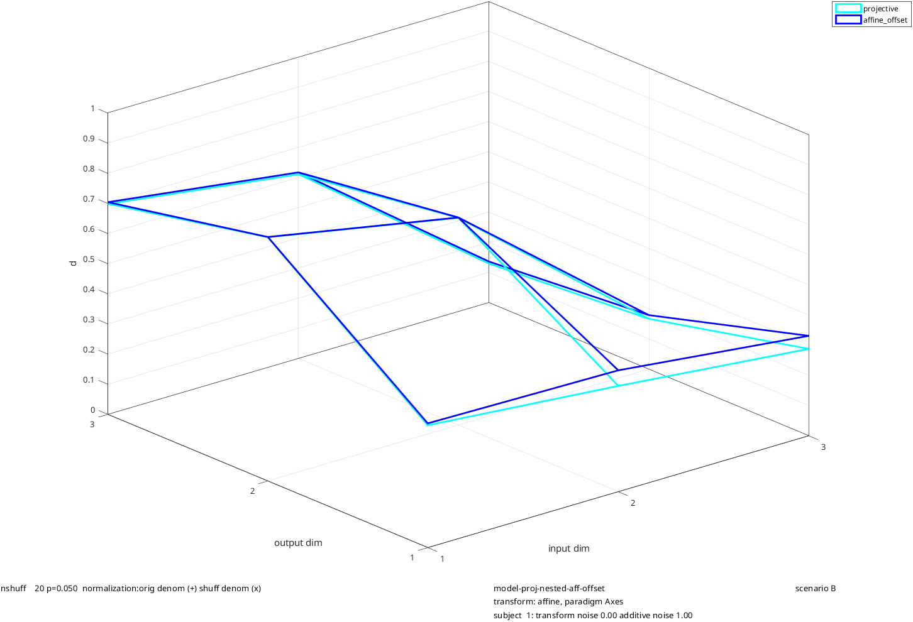
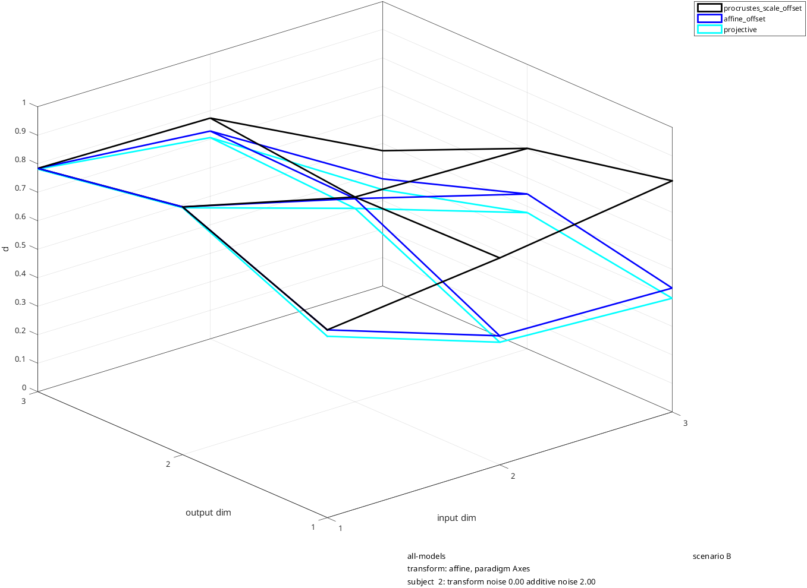
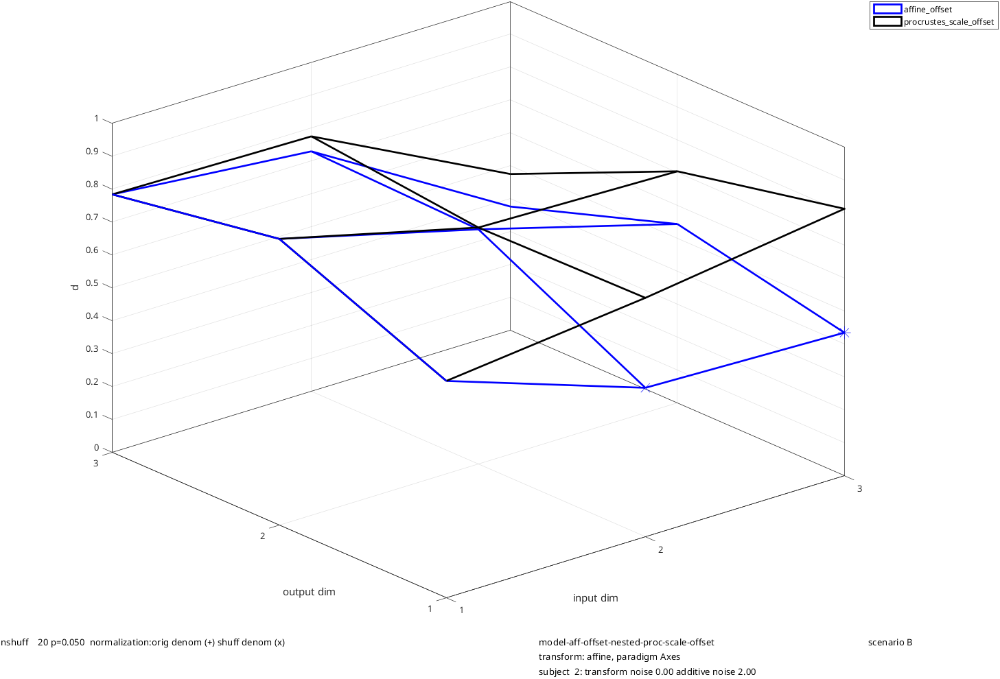
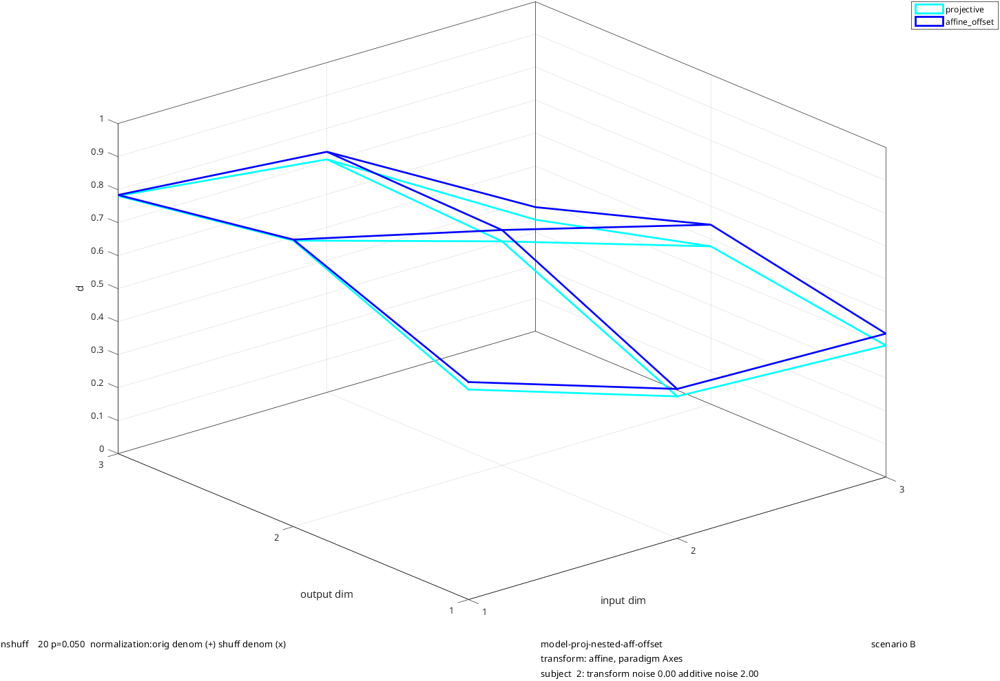
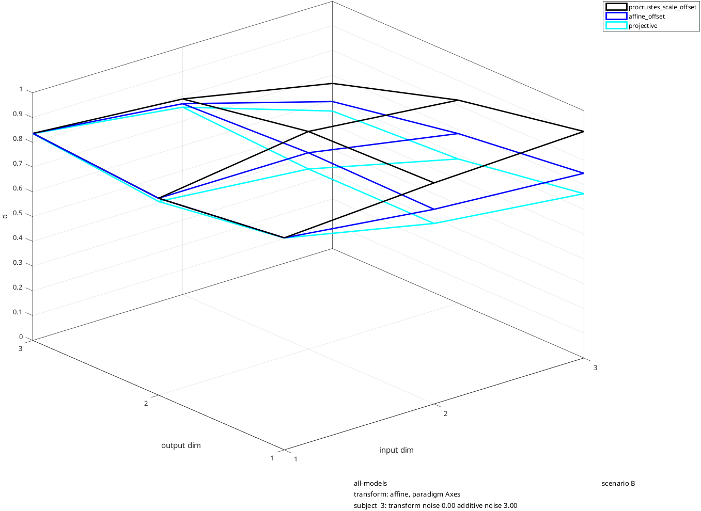
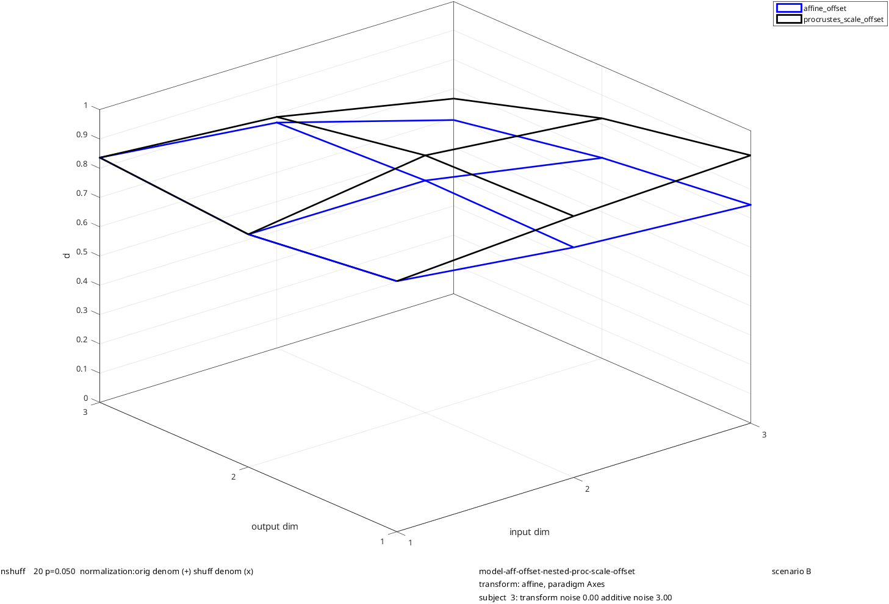
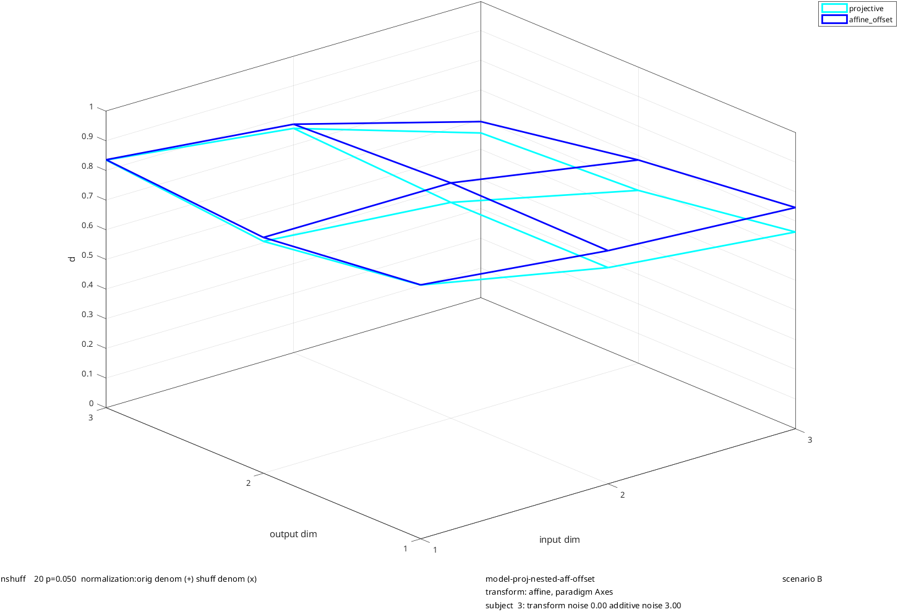

# rs_toygeom_scenarioB
Geometric transformations, with statistical analysis of nested models: procrustes, affine, projective

Scenario B for rs_toygeom_sim:
illustration of geometric models, focusing on nesting by model

Geometric model simulated: affine (3 dimensions)
Shows that:
* In all subjects, affine fits better than procrustes, and projective fits better than affine
  (as expected, since procrustes is a special case of affine which is a special case of projective)
 * With low noise (subject 1), affine is statistically better than procrustes, and projective is not statistically better than affine
 * With medium noise (subject 2), affine is statistically better than procrustes for 2-dim fit, and projective is not statistically better than affine
 * With high noise (subject 3), affine is not statisticlaly better than procrustes, and projective is not statistically better than affine

```matlab
clear; %parameters are read from the workspace, so start from a clean one
scenario_name='scenario B';
```

transform selection

```matlab
transform_names={'affine'};
affine_mag=0.3;
```

paradigm customizations

```matlab
paradigm_names={'Axes'};
```

subject customizations

```matlab
nsubjs=3;
subjs_disp=[1:3];
ncoords_noise=0;
noise_transform_mag=0;
noise_add_subj=[1 2 3]; %modest noise
```

geometric model selection

```matlab
model_list={'procrustes_scale_offset','affine_offset','projective'};
```

```matlab
opts_geof=struct;
opts_geof.if_stats=1;
```

```matlab
rs_toygeom_sim; %create the stimuli and datasets, and fit the models
```

Output:

```text
  1 transforms set up, on   3 coordinates.
jittered transformations created for  3 subjects
coordinate sets created for paradigm Axes
ray structure created for paradigm Axes
dataspace created for paradigm                 Axes and transform affine
 
modeling transform               affine from stimulus space to subject space with paradigm                 Axes
consider saving the structure 'sims', and using rs_toygeom_disp to display results
```



geometric model fit display customizations

```matlab
paradigms_fit_show={'Axes'};
subjs_fit_show=[1:nsubjs];
opts_dgeo=struct;
opts_dgeo.view=[-40 30];
opts_dgeo.if_nestbydim_show=0;
```

```matlab
rs_toygeom_disp; %display model-fitting results
```

















