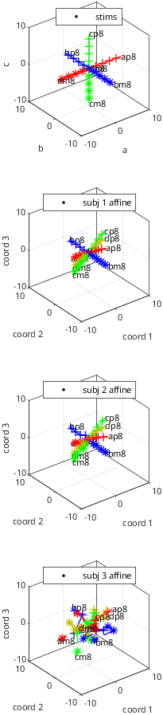
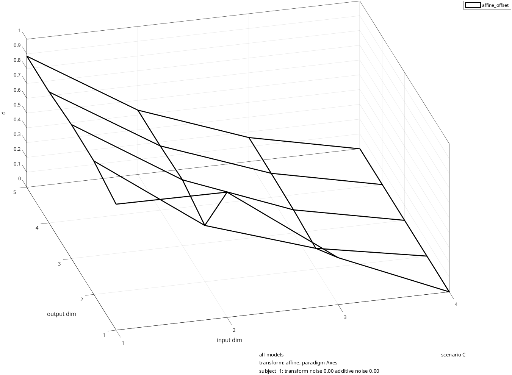
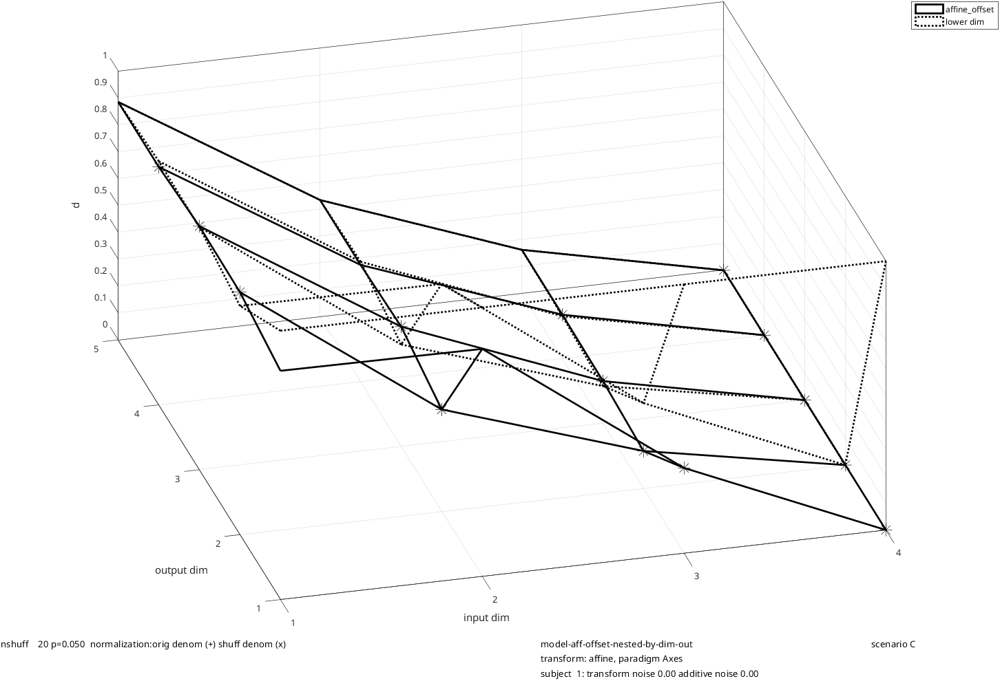
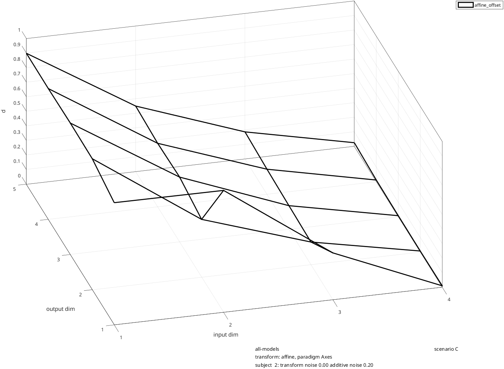
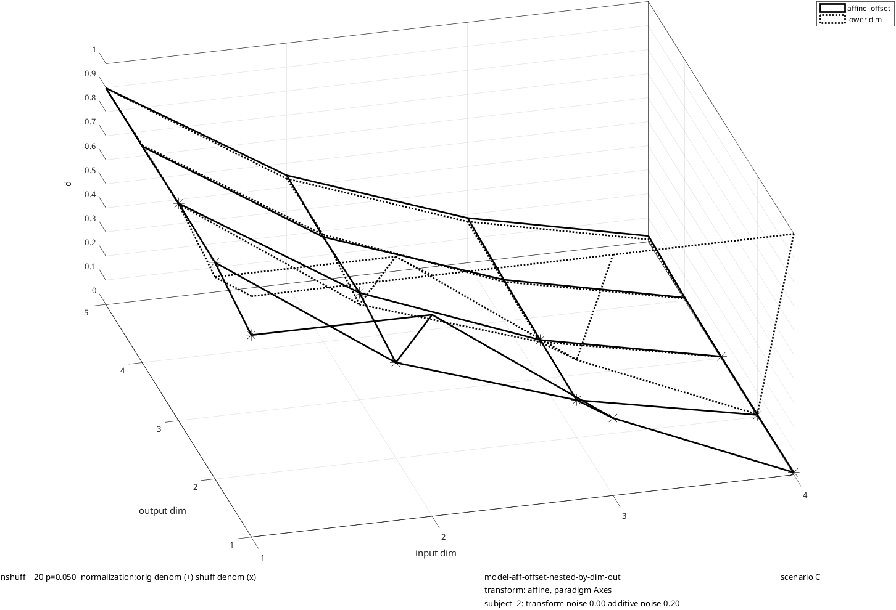
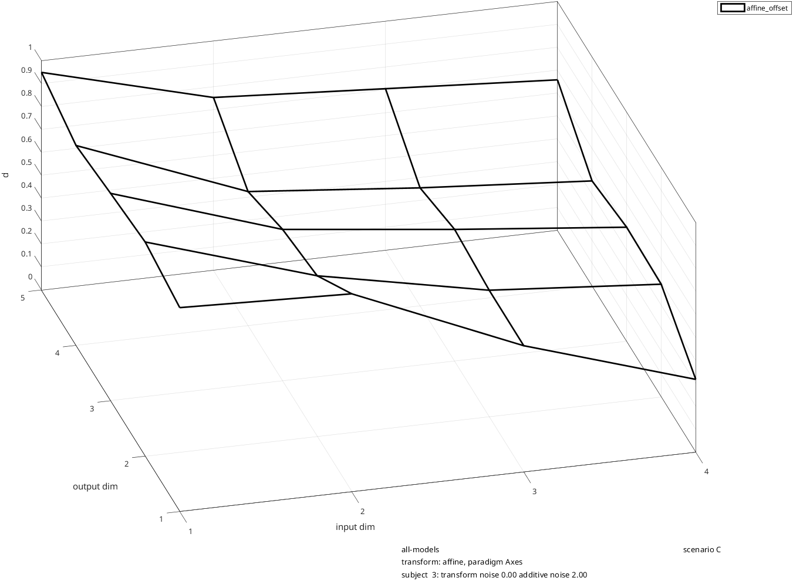
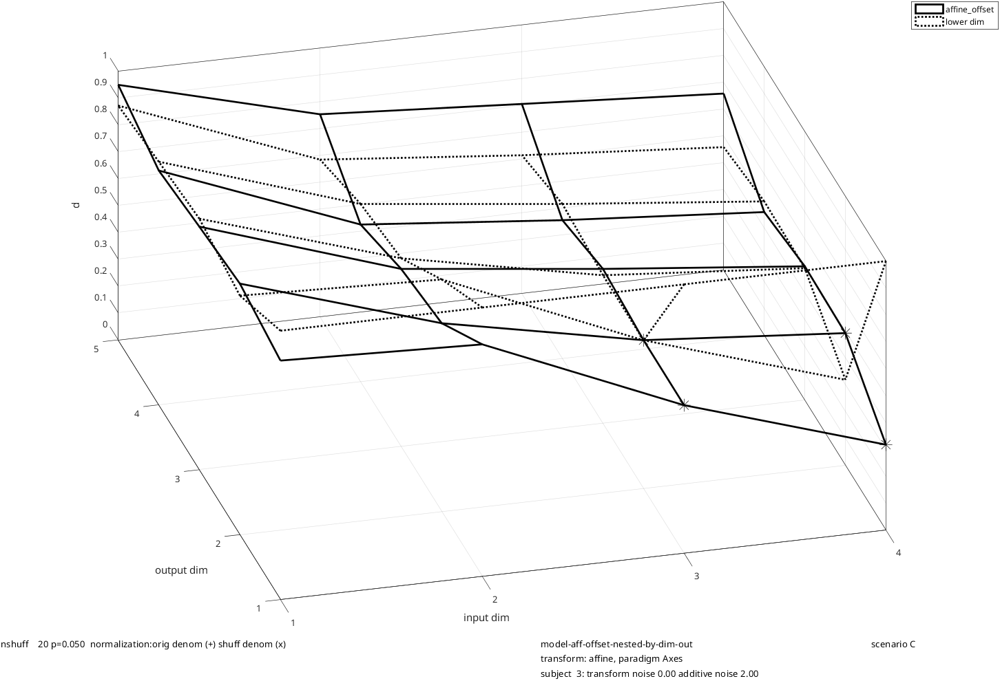

# rs_toygeom_scenarioC
Geometric transformations, affine model, with statistical analysis of nesting by output dimension

Scenario C for rs_toygeom_sim:
illustration of geometric models, focusing on nesting by output dimension

Geometric model simulated: affine (4 dimensions)
Shows that:
 * With low noise (subject 1), modeling all 4 output dimensions is an improvement over modeling dimensions 1-3
 * With medium noise (subject 2), adding output dimension 4 is not a statistically significant improvement
 * With high noise (subject 3), adding output dimension 3 is not a statistically significant improvement

```matlab
clear; %parameters are read from the workspace, so start from a clean one
scenario_name='scenario C';
```

transform selection

```matlab
transform_names={'affine'};
affine_mag=0.3;
```

paradigm customizations

```matlab
paradigm_names={'Axes'};
```

subject customizations

```matlab
nsubjs=3;
subjs_disp=[1:3];
ncoords=4;
ncoords_noise=1;
noise_add_subj=[0 0.2 2.0]; %a range of noise levels
```

geometric model selection

```matlab
model_list={'affine_offset'};
```

```matlab
opts_geof=struct;
opts_geof.if_stats=1;
```

```matlab
rs_toygeom_sim; %create the stimuli and datasets, and fit the models
```

Output:

```text
  1 transforms set up, on   4 coordinates.
jittered transformations created for  3 subjects
coordinate sets created for paradigm Axes
ray structure created for paradigm Axes
dataspace created for paradigm                 Axes and transform affine
 
modeling transform               affine from stimulus space to subject space with paradigm                 Axes
consider saving the structure 'sims', and using rs_toygeom_disp to display results
```



geometric model fit display customizations

```matlab
paradigms_fit_show={'Axes'};
subjs_fit_show=[1:nsubjs];
opts_dgeo=struct;
opts_dgeo.view=[-15 45];
opts_dgeo.if_nestbydim_in_show=0;
```

```matlab
rs_toygeom_disp; %display model-fitting results
```











