# rs_toygeom_scenarioD
Geometric transformations, affine model, with statistical analysis of nesting by input dimension

Scenario D for rs_toygeom_sim:
illustration of geometric models, focusing on nesting by input dimension and "knitting" datasets together

Geometric model simulated: affine (3 dimensions)
Shows that:
  With sampling in dimensions 1 and 2 (Rings_C12), adding a third dimension to the model does not improve the fit
  With sampling in dimensions 1 and 3 (Rings_C13), adding the second dimension does not improve the fit but adding the third dimension does
  With sampling in dimensions 2 and 3 (Rings_C23), the first dimension does not improve the fit but the other two dimensions do
  With knitting together all datasets ('knitted'), all dimensions contribute to the fit

```matlab
clear; %parameters are read from the workspace, so start from a clean one
scenario_name='scenario D';
```

transform selection

```matlab
transform_names={'affine'};
affine_mag=0.3;
```

paradigm customizations

```matlab
paradigm_names={'Rings_C12','Rings_C13','Rings_C23'};
```

subject customizations

```matlab
nsubjs=1;
ncoords=3;
ncoords_noise=1;
noise_add_subj=0.3; % moderate noise
```

geometric model selection

```matlab
model_list={'affine_offset'};
if_knit=1;
```

```matlab
opts_geof=struct;
opts_geof.if_stats=1;
```

```matlab
rs_toygeom_sim; %create the stimuli and datasets, and fit the models
```

Output:

```text
  1 transforms set up, on   3 coordinates.
jittered transformations created for  1 subjects
coordinate sets created for paradigm Rings_C12
coordinate sets created for paradigm Rings_C13
coordinate sets created for paradigm Rings_C23
ray structure created for paradigm Rings_C12
ray structure created for paradigm Rings_C13
ray structure created for paradigm Rings_C23
dataspace created for paradigm            Rings_C12 and transform affine
dataspace created for paradigm            Rings_C13 and transform affine
dataspace created for paradigm            Rings_C23 and transform affine
 
aligning stimuli across paradigms
knitting data across paradigms
 
aligning data from subject 1, transform affine, across paradigms
knitting data from subject 1, transform affine, into a single dataset
 
modeling transform               affine from stimulus space to subject space with paradigm            Rings_C12
modeling transform               affine from stimulus space to subject space with paradigm            Rings_C13
modeling transform               affine from stimulus space to subject space with paradigm            Rings_C23
modeling transform               affine from stimulus space to subject space with paradigm              knitted
consider saving the structure 'sims', and using rs_toygeom_disp to display results
```

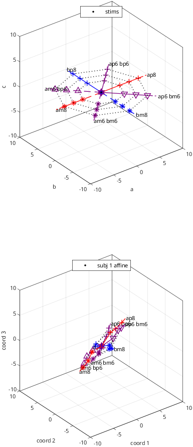

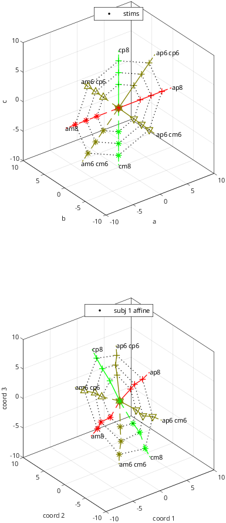

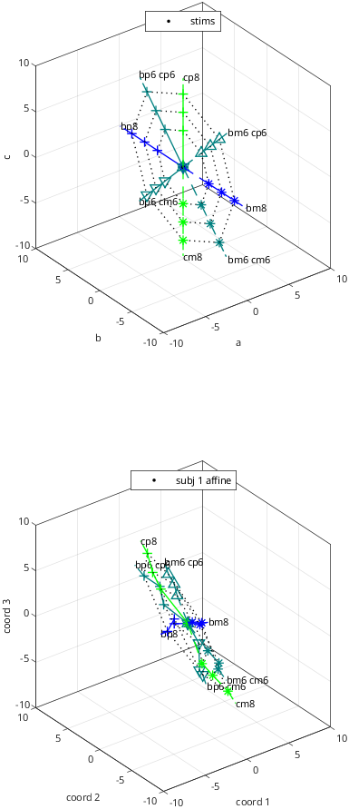

geometric model fit display customizations

```matlab
subjs_fit_show=[1:nsubjs];
opts_dgeo=struct;
opts_dgeo.view=[-15 45];
opts_dgeo.if_nestbydim_out_show=0;
```

```matlab
rs_toygeom_disp; %display model-fitting results
```

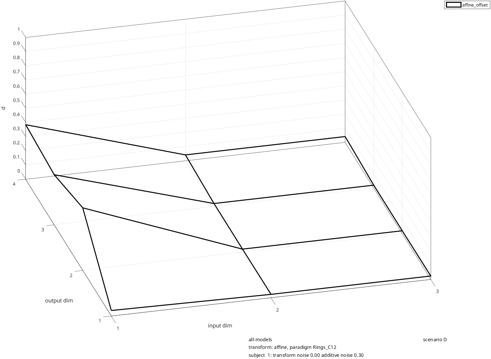

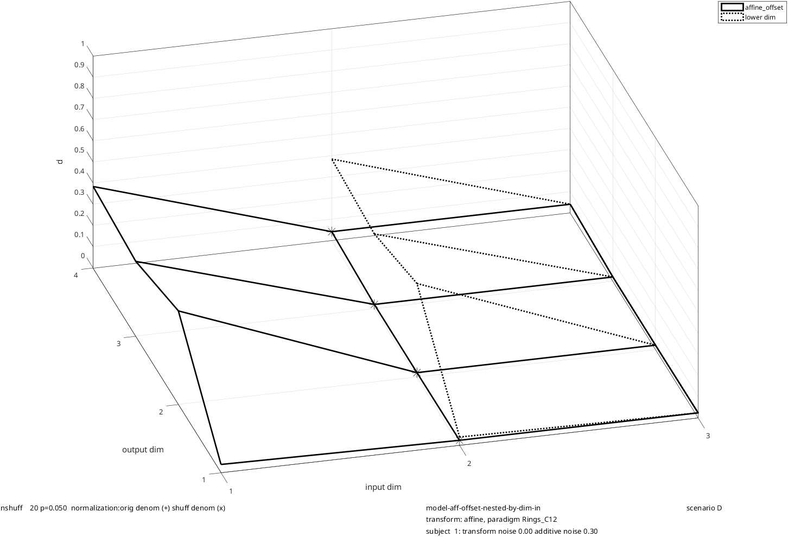

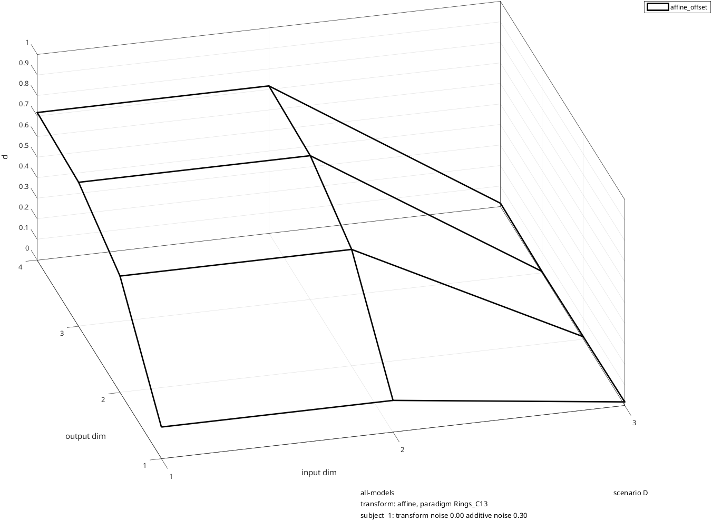

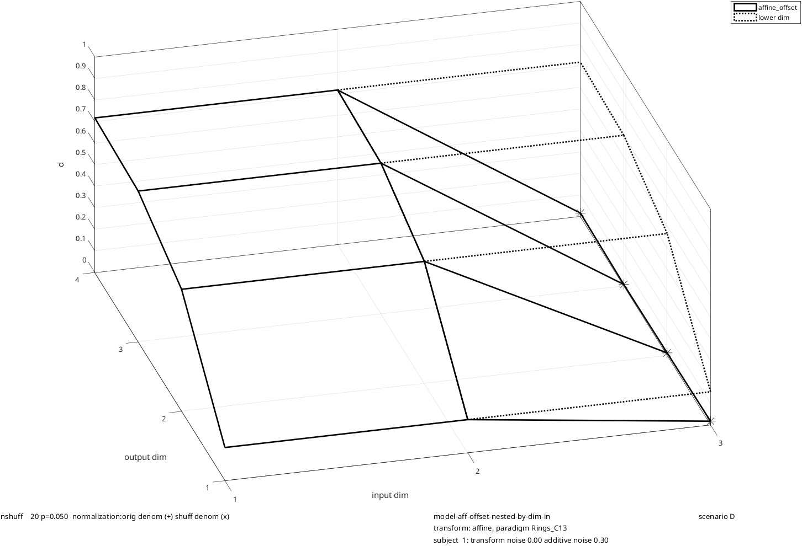

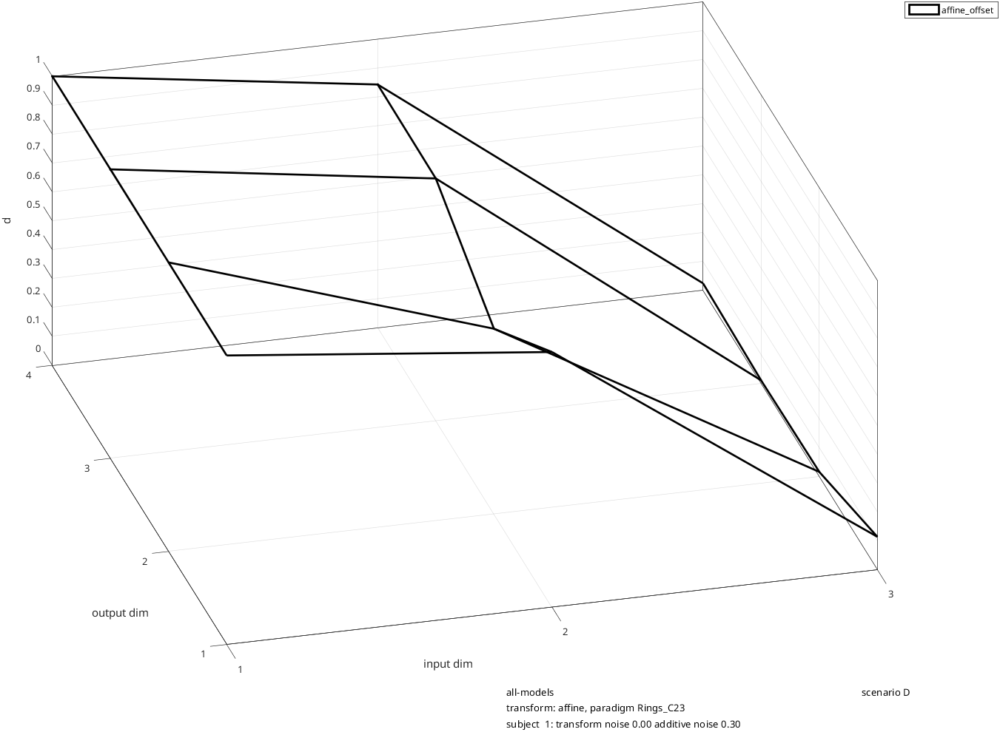

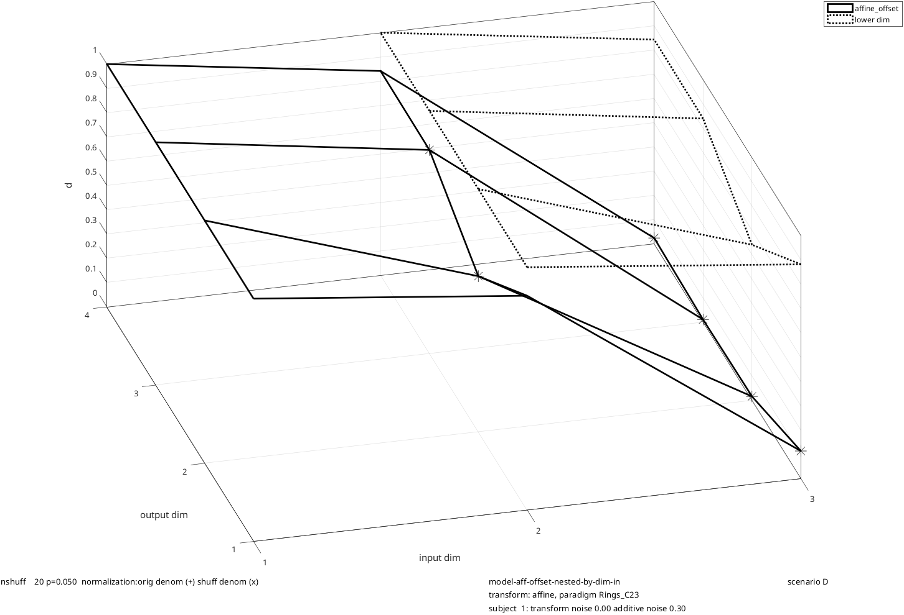

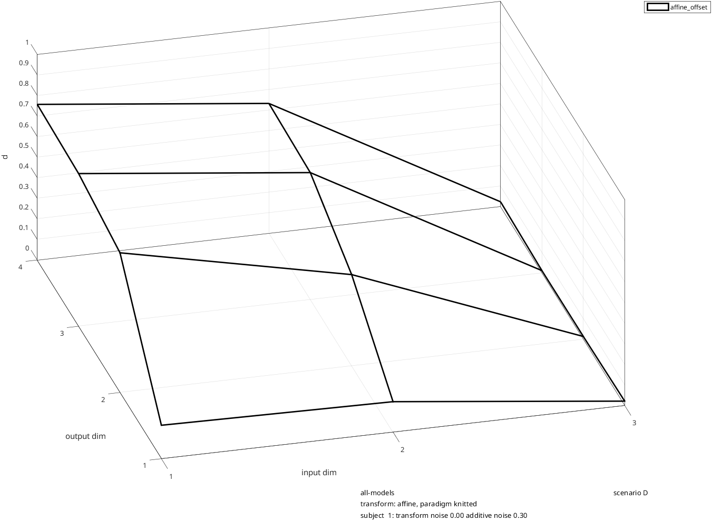

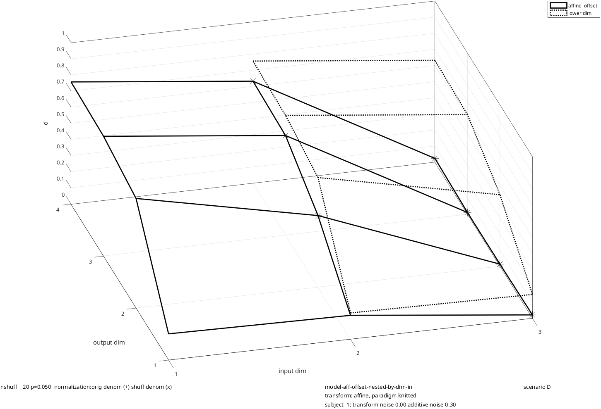