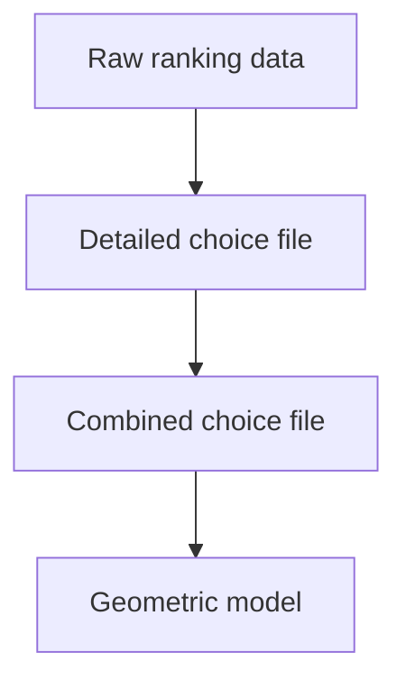

# Creating RS from perceptual judgments (python)

This pipeline processes similarity judgments from behavioral experiments and fits geometric models to those judgments.

It is designed for experiments where participants make relative similarity judgments, such as:
> "Is stimulus A more similar to B or to C?"

## What this pipeline does

The pipeline transforms raw behavioral data into a geometric representation in three steps:

1. Convert ranking responses into pairwise comparisons
2. Aggregate those comparisons into choice probabilities
3. Fit a model where distances between stimuli explain those probabilities

> rank judgments &rarr; pairwise comparisons &rarr; choice probabilities &rarr; geometric models 

The final outputs are:

- A geometric model of the perceptual space, i.e., coordinates for each stimulus 
  - closer points → more similar 
  - farther points → less similar 
- Log-likelihoods of each model, describing how well distances explain behavior

This is a simplified description. For full details, see Waraich & Victor (2022) and Waraich & Victor (2024).
The present implementation is a more user-friendly version of the code used in these studies.


## Entry Points

The `rs_py` package can be used at three stages of the analysis pipeline.

### Step 1: Raw Rankings to Detailed Choice File

Use `write_choice_file_detailed`.

**Input:** Raw ranking data (CSV files) collected using the Waraich & Victor paradigm.

**Output:** A detailed choice file: 

```text
*_detailed_choices_<subject>.mat
```

This file contains trial-by-trial similarity judgments. Each row corresponds to a single comparison made during a trial, along with metadata describing the experiment.

**Associated Demo:** `demo_detailed_choices.py`

If you are new to the package, we recommend running the demo first using the sample data included with the repository. See the **Demos** section for a complete walkthrough.

**Note:** This step is specific to the ranking paradigm described in Waraich & Victor (2022, 2024). If your data come from a different paradigm, you should typically start at Step 2 or Step 3 instead.

---

### Step 2: Detailed Choice File to Combined Choice File

Use `write_choice_file_combined`.

**Input:** A detailed choice file.

**Output:** A combined choice file:

```text
*_combined_choices_<subject>.mat
```

This step aggregates repeated occurrences of the same comparison across trials and sessions. The resulting file contains unique comparisons along with the number of times each judgment was observed.

Think of this as converting trial-by-trial data into summary statistics that are ready for model fitting.

**Associated Demo:** `demo_combined_choices.py`

The demo can be run using the sample detailed choice file produced in Step 1. See the **Demos** section for details.

---

### Step 3: Combined Choice File to Geometric Model

Use `run_model_fitting`.

**Input:** A combined choice file.

**Output:**

* Stimulus coordinates
* Model likelihoods
* A summary `.mat` file containing model results

This step fits geometric models that explain the observed similarity judgments. The model searches for coordinates such that distances between points best account for the observed choice probabilities.

The resulting coordinates can be interpreted as a geometric representation of the perceptual space underlying the behavioral data.

**Associated Demo:** `demo_fit_euclidean.py`

The demo can be run using the sample combined choice file produced in Step 2. See the **Demos** section for details.


## Demos

If you are new to `rs_py`, we recommend starting with the demos. The demos use sample data included with the repository and illustrate the three stages of the pipeline:



- [Demo 1: Raw Rankings → Detailed Choice File](/rs-software/rs-py-demo1/)
- [Demo 2: Detailed Choice File → Combined Choice File](/rs-software/rs-py-demo2/)
- [Demo 3: Combined Choice File → Geometric model](/rs-software/rs-py-demo3/)

Each demo corresponds to one of the three entry points described above.


# References
Waraich, S. A., & Victor, J. D. (2022). A Psychophysics Paradigm for the Collection and Analysis of Similarity Judgments. Journal of Visualized Experiments, 181. https://doi.org/10.3791/63461

Waraich, S. A., & Victor, J. D. (2024). The Geometry of Low- and High-Level Perceptual Spaces. Journal of Neuroscience, 44(4), e1460232023–e1460232023. https://doi.org/10.1523/jneurosci.1460-23.2023
